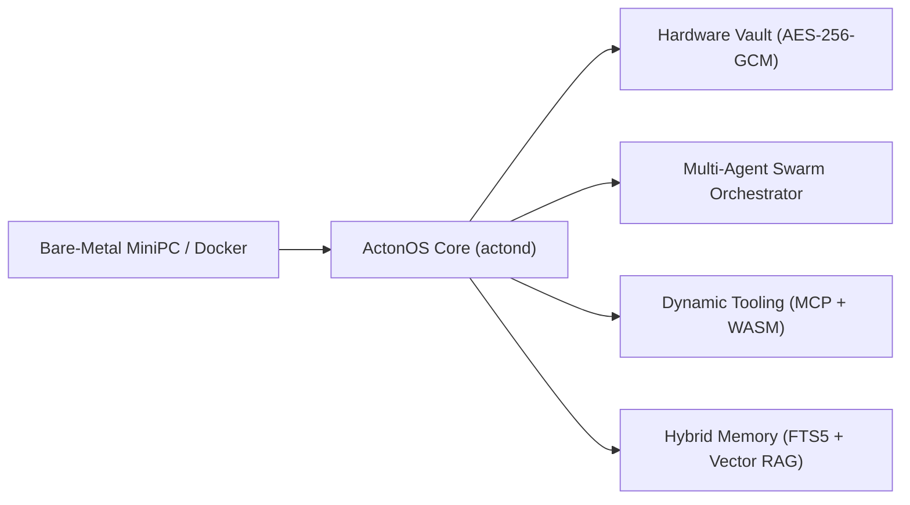

We are thrilled to announce the official release of **ActonOS v0.1** — the open-source, AI-native operating system designed to run autonomous multi-agent swarms 24/7 on dedicated MiniPC hardware and containerized Docker hosts.

<!-- truncate -->

## Why an AI-Native Operating System?

Current AI agent frameworks typically operate as Python CLI wrappers or desktop applications that execute untrusted scripts directly in user environments. While convenient for quick experimentation, this paradigm suffers from critical limitations when running autonomous systems long-term:

1. **Lack of Isolation**: Scripts running directly on host machines can accidentally delete files or exhaust CPU/RAM resources.
2. **Plaintext Secrets**: API keys and OAuth tokens are frequently stored unencrypted in `.env` files or JSON configs.
3. **Fragile State & Restarts**: Crashes or power cuts erase running tasks without durable checkpoint recovery.
4. **Complex Network Setup**: Exposing agents across private home networks often requires insecure port forwarding.

**ActonOS rethinks this from the ground up** by placing agents, sandboxed tooling runtimes, hybrid semantic memory, and hardware-bound encryption directly into the core operating system layer.



---

## Key Highlights of ActonOS v0.1

### 1. Dual-Runtime Hardware Abstraction Layer (HAL)
ActonOS compiles into a single static Go daemon (`actond`, `CGO_ENABLED=0`) that automatically detects whether it is running on **Bare-Metal MiniPC hardware** or inside a **Docker Container**:
- On Bare-Metal MiniPCs, it interfaces with Linux D-Bus, manages Wi-Fi Captive Portal hotspots (`ActonOS-XXXX`), enforces Bubblewrap namespaces, and governs CPU/RAM limits via Cgroups v2.
- In Docker, it provides a pre-configured, batteries-included agent runtime with Python, Node.js, Chromium, and Ripgrep.

### 2. Multi-Agent Swarm & Delegation
Create unlimited AI agents with custom personas, LLM cascade routers (OpenAI, Claude, Gemini, DeepSeek, Ollama), and tool scopes. Agents can delegate tasks to specialized child agents concurrently via Go Goroutines, with structured approval ledgers for high-risk mutations.

### 3. Dynamic Tooling Hub (MCP, WASM & Skills)
Hot-load external capabilities at runtime without restarting the daemon:
- **Model Context Protocol (MCP)**: Native stdio and HTTP/SSE JSON-RPC client.
- **WebAssembly Plugins**: Pure-Go WASI runtime powered by `wazero`.
- **Skill-as-a-Folder**: Auto-reloading directory scripts (`skill.json` + `run.sh`/`run.py`) with `fsnotify`.

### 4. Hybrid Semantic Memory (RAG)
Combines SQLite FTS5 lexical keyword matching with Chromem-go local vector embeddings generated by the pinned `multilingual-e5-small` ONNX model. Incorporates a 1-minute durable debounce queue and Ebbinghaus forgetting curve decay.

### 5. Hardware-Bound Vault & Cryptographic Audit Trail
API keys and OAuth 2.1 PKCE tokens are encrypted with AES-256-GCM keys derived from physical system hardware identifiers (DMI UUID + CPU serial) via Argon2id. Every security event is chained in an immutable SHA-256 ledger (`audit.jsonl`).

### 6. Zero-Config Remote Access via Tailscale `tsnet`
The core daemon embeds Tailscale's pure-Go `tsnet` client directly, providing an encrypted WireGuard mesh connection and automatic HTTPS domain (`https://acton.<tailnet>.ts.net`) without opening inbound router firewall ports.

---

## Getting Started

You can deploy ActonOS in under a minute with Docker:

```bash
docker run -d \
  --name actonos \
  -p 8080:8080 \
  -v acton-data:/data \
  -e RUNTIME_MODE=docker \
  --restart unless-stopped \
  ghcr.io/actonos/actonos:latest
```

Or flash the bootable **`ActonOS-v0.1.iso`** onto a USB drive to turn any Intel N100 or AMD Ryzen MiniPC into a dedicated AI appliance.

- 📖 **Read the Documentation**: [Getting Started Guide](/getting-started/overview)
- 🐙 **Explore the Codebase**: [GitHub Repository](https://github.com/actonos/actonos)
- 💬 **Join the Community**: [Discord Server](https://discord.gg/actonos)
