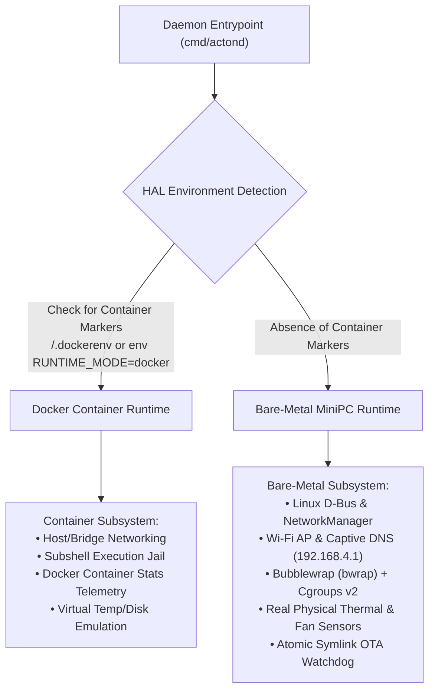

# Dual-Runtime Hardware Abstraction Layer (HAL)

ActonOS utilizes an intelligent **Hardware Abstraction Layer (HAL)** that auto-detects its hosting environment on boot and adapts all system daemons accordingly.

---

## Runtime Differences & Capability Matrix

| Feature Subsystem | Bare-Metal MiniPC Mode | Docker Container Mode |
|:---|:---|:---|
| **Base OS Layer** | Debian 12 Minimal (Read-only root) | Alpine Linux / Ubuntu slim base |
| **Sandbox Technology** | Kernel Namespaces via `bubblewrap` (`bwrap`) | Jailed Subshell + Non-root `acton` user |
| **Resource Limits** | Linux `cgroups v2` (RAM, CPU quota, PIDs) | Docker container resource constraints |
| **Network Management** | D-Bus `NetworkManager` + `wpa_supplicant` | Docker bridge / host networking |
| **Wi-Fi Hotspot** | AP Mode with `dnsmasq` captive portal | N/A (Web UI wizard on `:8080`) |
| **OTA Updates** | Atomic `/data/bin/actond` symlink swap + Watchdog | Standard `docker pull` image updates |
| **Hardware Telemetry** | Native D-Bus CPU thermal & NVMe sensors | `/sys/fs/cgroup` and `/proc` metrics |

---

## Automatic Detection Mechanics

The HAL initializes before any agent services start:
1. It checks the `RUNTIME_MODE` environment variable (`docker` or `baremetal`).
2. If unset, it inspects filesystem markers (`/.dockerenv`, `/run/.containerenv`) and cgroup hierarchy definitions.
3. It sets the global HAL interface which routes all network, sensor, and sandbox calls to the appropriate driver.
