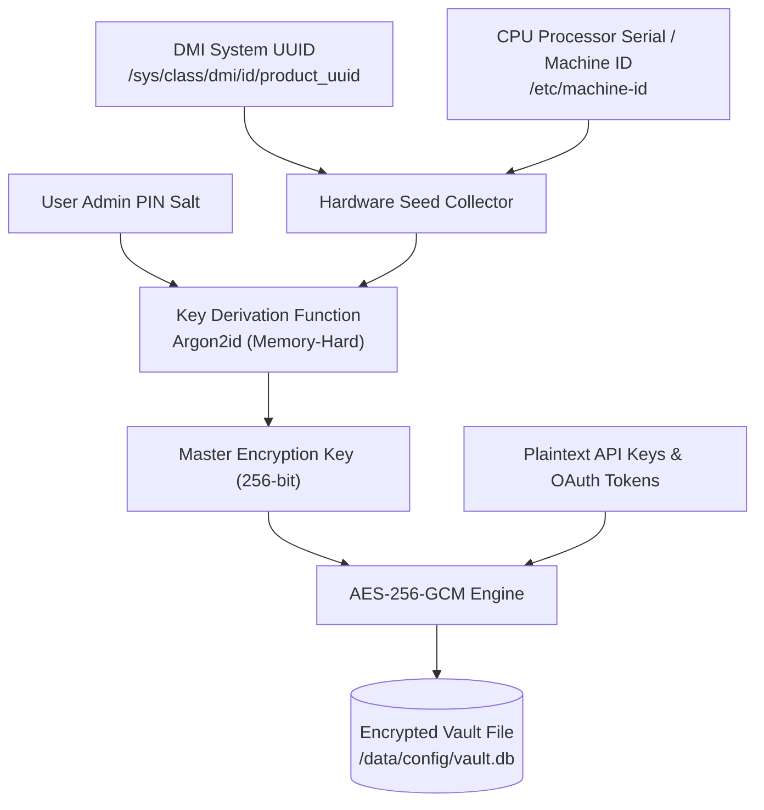

# Hardware-Bound Vault & Cryptography

ActonOS implements a zero-trust credential storage system where sensitive secrets, API keys, and OAuth refresh tokens are encrypted using **AES-256-GCM** with keys derived cryptographically from physical hardware identifiers.



---

## 1. Hardware Fingerprinting & Key Derivation

On Bare-Metal hosts, the Vault derives its root encryption key from:
1. **DMI System UUID**: Unique hardware identifier from the motherboard BIOS.
2. **System Machine ID**: Pinned machine identifier.
3. **Argon2id KDF**: Key derivation with 64 MB memory cost and 4 parallel iterations.

:::important Theft & Drive Cloning Resistance
If an attacker physically extracts the NVMe SSD or clones the disk image to a different machine, the derived hardware key will not match, rendering the contents of `/data/config/vault.db` and `/data/tokens/oauth_tokens.vault` completely unreadable.
:::

---

## 2. Docker Container Vault Fallback

In containerized environments where DMI hardware tables are masked:
- ActonOS uses a cryptographically generated vault master seed saved during initial setup or injected via the `VAULT_ENCRYPTION_KEY` environment variable.
- In-memory encryption guarantees that secrets are never leaked to logs or unencrypted memory dumps.

---

## 3. Cryptographically Chained Audit Ledger (`audit.jsonl`)

Every security-sensitive event (tool invocation, approval grant/rejection, token refresh, login attempt) is recorded in an immutable, forward-secure append-only log:

```
Hash(n) = SHA-256(Hash(n-1) || Timestamp(n) || EventPayload(n))
```

The system provides an audit verification endpoint (`GET /api/system/audit/verify`) that checks the entire hash chain from the genesis record to detect any tampering, modification, or record deletion.
