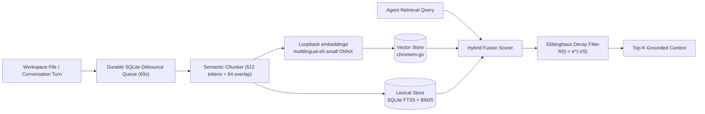

# Hybrid Semantic Memory & Local Vector RAG

ActonOS implements a zero-cloud-dependency **Hybrid Memory Engine** that combines exact lexical search, dense vector embeddings, and cognitive forgetting curves.

---

## 1. The Local ONNX Embedding Helper (`embeddingd`)

To keep the main `actond` daemon a 100% pure static Go binary (`CGO_ENABLED=0`), local ONNX neural inference runs in a separately packaged loopback helper daemon:

- **Model**: `intfloat/multilingual-e5-small` (384-dimensional vector embeddings).
- **Languages**: 100+ languages including English, Vietnamese, Chinese, Japanese, French, Spanish, German.
- **Latency**: Under 15ms per chunk on low-power Intel N100 MiniPCs.

---

## 2. Durable Debounce Queue

When an agent or user writes multiple files rapidly, ActonOS queues paths in a persistent SQLite table (`workspace_embedding_queue`):
- Debounce window: **60 seconds**.
- Eliminates redundant vector calculations during rapid compilation or file editing.
- Survives unexpected host crashes without losing indexing state.

---

## 3. Cognitive Decay (Ebbinghaus Forgetting Curve)

To prevent irrelevant historical logs from crowding LLM context windows, memories are weighted using the Ebbinghaus exponential decay model:

$$
R(t) = e^{-\frac{t}{S}}
$$

Where:
- $R(t)$ is the memory retention strength.
- $t$ is the elapsed time since last retrieval or reinforcement.
- $S$ is the memory stability score (boosted whenever an agent references the memory item).
