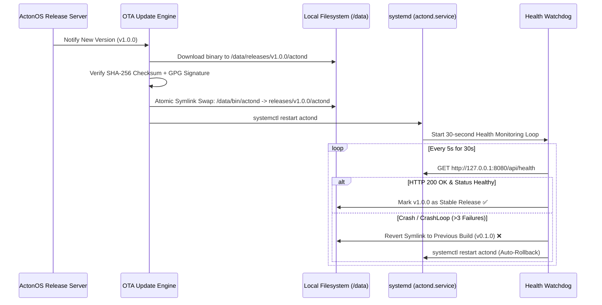

# Immutable OS Design & Self-Healing OTA Updates

On Bare-Metal MiniPC deployments, ActonOS employs an **Immutable Operating System** architecture combined with an **Atomic, Self-Healing Over-The-Air (OTA) Update System** that protects against bad builds, corrupted updates, and power interruptions.



---

## 1. Immutable Partition Layout

The physical SSD is partitioned into strictly isolated zones:
- **System Root Partition (`/`)**: Mounted **Read-Only** (`ro`) Ext4. Core OS utilities, libraries, and kernel modules cannot be modified by malware, user errors, or rogue scripts.
- **Data Partition (`/data`)**: Mounted **Read-Write** (`rw`) Ext4. Houses all persistent configuration, user databases, agent workspaces, and versioned binary releases.

---

## 2. Atomic Symlink Swapping

All executions of the core daemon invoke the binary via a symbolic link:
```
/data/bin/actond -> /data/releases/v1.0.0/actond
```

When an update is applied:
1. The new binary is downloaded and verified in isolation under `/data/releases/v1.0.0/`.
2. An atomic filesystem symlink swap (`ln -sfn`) switches `/data/bin/actond` to point to the new release directory instantly.
3. The system service restarts.

---

## 3. 30-Second Health Watchdog & Automatic Rollback

Following a service restart:
- A dedicated background watchdog polls the internal health endpoint (`GET http://127.0.0.1:8080/api/health`) every 5 seconds.
- If the new build crashes, hangs, or fails health checks 3 consecutive times during the 30-second verification window, the watchdog **automatically reverts the symlink to the previous working release** and restarts the daemon.
- The machine never becomes an unrecoverable "brick".
