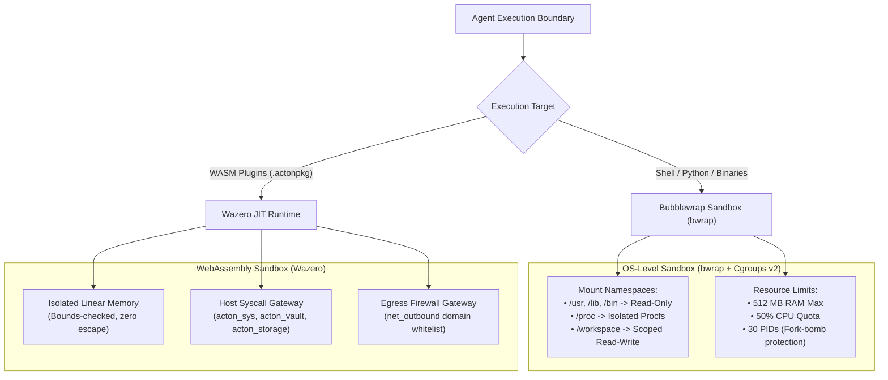

# Sandbox Isolation & Multi-Layer Security

To allow autonomous agents and plugins to execute untrusted scripts, compile code, and run external integrations safely, ActonOS enforces strict multi-layered isolation using **Bubblewrap (`bwrap`)**, **Linux Control Groups (Cgroups v2)**, and the **Wazero WebAssembly JIT Sandbox**.

---

## 1. WebAssembly (WASM) Sandbox Isolation

All plugins (`.actonpkg` / `.wasm`) run inside the pure-Go **Wazero WebAssembly JIT engine**:
- **Linear Memory Safety**: Plugins cannot access host memory or pointer addresses outside their dedicated WebAssembly linear memory pool.
- **Zero Raw Sockets**: Direct TCP/UDP socket calls are blocked at the WASI boundary. All network requests must use the `acton_net: http_request` or `acton_ws: ws_*` host syscalls.
- **Egress Domain Firewall**: Outbound HTTP traffic is evaluated against the `manifest.permissions.net_outbound` whitelist. Any connection attempt to an unlisted domain is rejected immediately.
- **Hardware Vault Brokering**: Plugins never read encryption keys directly; requests for credentials pass through the `acton_vault` syscall and are verified against `permissions.secrets`.

---

## 2. OS-Level Filesystem & Process Sandboxing (Bubblewrap)

For shell commands (`native_exec`), code compilers, and Python scripts:
- **System Binaries**: `/usr`, `/lib`, `/lib64`, and `/bin` are mounted **Read-Only** from the host image.
- **Sensitive Directories**: `/etc`, `/root`, `/home`, and `/data/config` (containing Vault keys) are **completely hidden** and unmounted.
- **Workspace Access**: The only writable directory is `/data/workspace` (or the agent's explicitly configured path scope).
- **Ephemeral Scratch**: A private `tmpfs` is mounted at `/tmp` and discarded upon process termination.

---

## 3. Resource Enforcements (Cgroups v2)

| Resource Metric | Default Limit | Behavioral Consequence on Breach |
|:---|:---|:---|
| **Max Memory (RAM)** | `512 MB` | Linux Kernel Out-Of-Memory (OOM) killer terminates the sandboxed child process without affecting `actond`. |
| **CPU Quota** | `50%` (0.5 core) | CPU throttling via CFS bandwidth controller prevents 100% CPU lockup. |
| **Max Processes (PIDs)** | `30` | `fork()` calls return `EAGAIN` to prevent fork bombs and runaway subprocesses. |
| **Execution Timeout** | `60 seconds` | SIGKILL dispatched automatically if a script hangs. |
