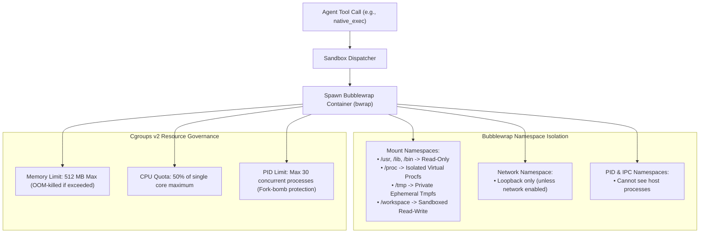

# Sandbox Isolation & Cgroups v2

To allow autonomous agents to execute untrusted scripts, compile code, and browse the web safely, ActonOS enforces strict kernel-level sandboxing using **Bubblewrap (`bwrap`)** and **Linux Control Groups (Cgroups v2)**.

---

## 1. Filesystem Namespace Restrictions

Inside the sandboxed execution environment:
- **System Binaries**: `/usr`, `/lib`, `/lib64`, and `/bin` are mounted **Read-Only** from the host image.
- **Sensitive Directories**: `/etc`, `/root`, `/home`, and `/data/config` (containing Vault keys) are **completely hidden** and unmounted.
- **Workspace Access**: The only writable directory is `/data/workspace` (or the agent's explicitly configured path scope).
- **Ephemeral Scratch**: A private `tmpfs` is mounted at `/tmp` and discarded upon process termination.

---

## 2. Resource Enforcements (Cgroups v2)

| Resource Metric | Default Limit | Behavioral Consequence on Breach |
|:---|:---|:---|
| **Max Memory (RAM)** | `512 MB` | Linux Kernel Out-Of-Memory (OOM) killer terminates the sandboxed child process without affecting the `actond` daemon. |
| **CPU Quota** | `50%` (0.5 core) | CPU throttling via CFS bandwidth controller prevents 100% CPU lockup. |
| **Max Processes (PIDs)** | `30` | `fork()` calls return `EAGAIN` to prevent fork bombs and runaway subprocesses. |
| **Execution Timeout** | `60 seconds` | SIGKILL dispatched automatically if a script hangs. |
