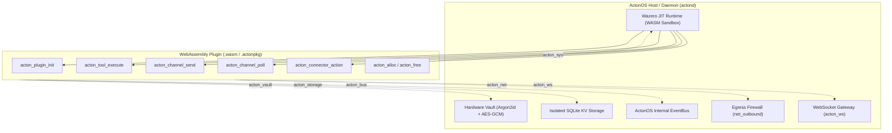

# WebAssembly (WASM) Plugin Development

ActonOS executes all plugins as WebAssembly (`wasip1` / `wasm32-wasi`) modules sandboxed inside the **Wazero JIT runtime** (a 100% pure Go WebAssembly engine with zero CGO dependencies).

The unified **WASMLoader** subsystem (`internal/plugin/`) consolidates **Agent Tools**, **Chat Channels** (Telegram, Discord, Slack, WhatsApp, Zalo), and **SaaS Connectors** (GitHub, Notion, Linear, Google Workspace) into secure, sandboxed `.wasm` packages and distributable `.actonpkg` zip bundles.

---

## 1. System Topology & Execution Model

Plugins execute in isolated WebAssembly linear memory instances managed by Wazero. All interactions with host capabilities (networking, vault secrets, storage, event bus, and WebSocket streams) are routed through typed host syscalls brokered by the ActonOS Security Gate.



---

## 2. Host ABI Syscall Contracts & Imports

Plugins interact with ActonOS host capabilities via typed WebAssembly imports declared under the `acton_*` module namespace:

| Host Module | Function | Signature | Description |
|:---|:---|:---|:---|
| `acton_sys` | `log` | `(level: int32, ptr: uint32, len: uint32)` | Emit structured logs to ActonOS logger (`1=Debug`, `2=Info`, `3=Warn`, `4=Error`). |
| `acton_sys` | `read_response` | `(destPtr: uint32, destLen: uint32) -> int32` | Copy buffered host response from previous syscall into WASM linear memory. |
| `acton_net` | `http_request` | `(reqPtr: uint32, reqLen: uint32) -> uint32` | Execute sandboxed HTTP request (subject to `net_outbound` domain whitelist). |
| `acton_ws` | `ws_connect` | `(urlPtr, urlLen, hPtr, hLen: uint32) -> int32` | Open WebSocket connection; returns connection `handleID` (or `-1` on error). |
| `acton_ws` | `ws_send` | `(handleID: int32, msgType: int32, dataPtr, dataLen: uint32) -> int32` | Send message over active WebSocket (`1=Text`, `2=Binary`). |
| `acton_ws` | `ws_poll` | `(handleID: int32) -> int32` | Non-blocking poll for incoming WebSocket frame (`>0=byteLen`, `0=empty`, `-1=closed`). |
| `acton_ws` | `ws_close` | `(handleID: int32) -> int32` | Terminate and release active WebSocket connection. |
| `acton_vault`| `get_secret` | `(keyPtr: uint32, keyLen: uint32) -> uint32` | Read hardware-encrypted credential from Vault (must match `permissions.secrets`). |
| `acton_storage`| `kv_get` | `(keyPtr: uint32, keyLen: uint32) -> uint32` | Fetch value from plugin's isolated SQLite key-value partition. |
| `acton_storage`| `kv_set` | `(kPtr, kLen, vPtr, vLen: uint32) -> int32` | Store key-value pair in isolated SQLite storage. |
| `acton_storage`| `kv_delete` | `(keyPtr: uint32, keyLen: uint32) -> int32` | Remove key from SQLite storage. |
| `acton_bus` | `emit_event` | `(tPtr, tLen, pPtr, pLen: uint32) -> int32` | Publish event onto system event bus (must match `permissions.bus_events`). |

---

## 3. WASM Export Entrypoints & Linear Memory Management

Every compiled plugin binary exposes standard entrypoint ABIs for lifecycle orchestration and data passing:

```go
// Linear memory allocators
//go:wasmexport acton_alloc
func acton_alloc(size uint32) uint32

//go:wasmexport acton_free
func acton_free(ptr uint32, length uint32)

// Lifecycle & Handlers
//go:wasmexport acton_plugin_init
func acton_plugin_init() int32

//go:wasmexport acton_tool_execute
func acton_tool_execute(namePtr uint32, nameLen uint32, argsPtr uint32, argsLen uint32) uint64 // Returns packed (ptr << 32 | len)

//go:wasmexport acton_channel_send
func acton_channel_send(ptr uint32, length uint32) int32

//go:wasmexport acton_channel_poll
func acton_channel_poll() uint64 // Returns packed (ptr << 32 | len)

//go:wasmexport acton_connector_action
func acton_connector_action(ptr uint32, length uint32) uint64 // Returns packed (ptr << 32 | len)
```

---

## 4. Core Plugin SDK Development Patterns

Plugins can be authored in Go (via `ActonOS-Plugin-SDK`), TinyGo, Rust, or any language compiling to WASI.

### 4.1. Typed Agent Tools (`sdk.Tool`)

Tools are callable functions exposed to ReAct Agent swarms with automatic JSON schema generation:

```go
package main

import (
	"github.com/actonos/actonos-plugin-sdk/sdk"
)

type WeatherInput struct {
	City  string `json:"city" jsonschema:"title=City Name,description=Target city,required"`
	Units string `json:"units" jsonschema:"title=Units,enum=celsius|fahrenheit,default=celsius"`
}

func init() {
	tool := sdk.NewTypedTool("get_weather", "Fetch current weather information", func(ctx sdk.Context, in WeatherInput) (*sdk.ToolResult, error) {
		resp, err := ctx.HTTP().Get("https://api.weather.com/v1/" + in.City)
		if err != nil {
			return sdk.NewResultError(err.Error()), nil
		}
		return sdk.NewResultData("Success", map[string]any{"city": in.City, "data": string(resp.Body)}), nil
	})
	sdk.RegisterTool(tool)
}

func main() {}
```

### 4.2. Chat Channels with Multi-Account & WebSocket (`sdk.ChannelAdapter`)

Channel adapters connect external messaging services with ActonOS agent swarms:

```go
type DiscordConfig struct {
	Accounts []DiscordAccount `json:"accounts"`
}

type DiscordAccount struct {
	AccountID    string `json:"account_id"`
	BotToken     string `json:"bot_token"`
	DefaultAgent string `json:"default_agent"`
}

type DiscordChannel struct {
	sdk.BaseChannel
}

func (c *DiscordChannel) SendMessage(ctx sdk.Context, msg sdk.OutboundMessage) error {
	token, _ := ctx.Vault().GetSecret("discord_bot_tokens." + msg.AccountID)
	// Dispatch message over HTTP or active WebSocket...
	return nil
}

func (c *DiscordChannel) PollMessages(ctx sdk.Context) ([]sdk.InboundMessage, error) {
	var cfg DiscordConfig
	_ = ctx.Config().Bind(&cfg)
	
	// Stream inbound messages via WebSocket (ctx.WS()) or REST polling
	return inbounds, nil
}
```

### 4.3. SaaS Connectors & Agent Tool Bridging (`sdk.Connector`)

Connectors integrate external SaaS APIs and automatically bridge their actions into callable ReAct Agent Tools:

```go
func init() {
	conn := sdk.NewBaseConnector("github", "GitHub", "oauth2").
		WithSecretKey("github_access_token")

	sdk.RegisterTypedAction(conn, "list_repos", "List user repositories", func(ctx sdk.Context, in ListInput) (any, error) {
		token, _ := conn.GetAuthToken(ctx)
		resp, err := ctx.HTTP().GetWithBearer("https://api.github.com/user/repos", token)
		return resp, err
	})

	sdk.RegisterConnector(conn)

	// Bridge all connector actions as ReAct Agent Tools!
	for _, tool := range conn.AsTools() {
		sdk.RegisterTool(tool)
	}
}
```

---

## 5. Schema-Driven Manifest (`manifest.json`) Standards

Every plugin package MUST declare a `manifest.json` describing its capabilities, granular permissions, and dynamic configuration schema adhering to `spec/MANIFEST_SCHEMA.json`:

```json
{
  "id": "channel-discord",
  "name": "Discord Bot Channel",
  "version": "2.0.0",
  "description": "Discord Bot integration for ActonOS AI agents",
  "author": "ActonOS Core Team",
  "license": "MIT",
  "capabilities": ["channel"],
  "permissions": {
    "net_outbound": ["discord.com", "gateway.discord.gg"],
    "secrets": ["discord_bot_tokens.*"],
    "storage": true,
    "bus_events": ["channel.discord.received", "channel.discord.sent"]
  },
  "config_schema": {
    "type": "object",
    "properties": {
      "poll_interval_seconds": {
        "type": "integer",
        "title": "Polling Interval (seconds)",
        "default": 3,
        "x-ui-group": "General Settings"
      },
      "accounts": {
        "type": "array",
        "title": "Discord Bot Accounts",
        "x-ui-group": "Bot Accounts",
        "items": {
          "type": "object",
          "required": ["account_id", "bot_token", "default_agent"],
          "properties": {
            "account_id": {
              "type": "string",
              "title": "Account ID",
              "x-ui-placeholder": "bot_support"
            },
            "bot_token": {
              "type": "string",
              "title": "Bot Token",
              "x-secret": true,
              "x-ui-widget": "password"
            },
            "default_agent": {
              "type": "string",
              "title": "Default Agent",
              "x-ui-widget": "agent-selector"
            }
          }
        }
      }
    }
  }
}
```

### UI Schema Extension Attributes

The ActonOS frontend uses JSON Schema UI hints to dynamically render settings forms:

- `x-secret: true`: Flags sensitive values so ActonOS encrypts and brokers them inside the **Hardware Vault** (`vault.db`).
- `x-ui-widget`: Specifies rich form components (`"password"`, `"agent-selector"`, `"textarea"`, `"slider"`).
- `x-ui-group`: Groups related fields into collapsible UI sections.
- `x-ui-placeholder`: Placeholder hint text inside inputs.
- `x-order`: Sorting order inside the generated form.

---

## 6. CLI Toolchain Runbook (`acton-plugin`)

The `acton-plugin` CLI toolchain automates compiling, validating, and packaging plugins:

```bash
# 1. Build plugin into WebAssembly binary (wasip1)
go run ./cmd/acton-plugin build -src ./plugins/channels/discord -out dist/channel-discord.wasm

# 2. Validate manifest against spec/MANIFEST_SCHEMA.json
go run ./cmd/acton-plugin validate -manifest ./plugins/channels/discord/manifest.json

# 3. Test plugin in MockHost sandbox
go run ./cmd/acton-plugin test -wasm dist/channel-discord.wasm

# 4. Package into production distributable .actonpkg bundle
go run ./cmd/acton-plugin pack -manifest ./plugins/channels/discord/manifest.json -wasm dist/channel-discord.wasm -out dist/channel-discord.actonpkg
```

---

## 7. Packaging & Distributing `.actonpkg`

An `.actonpkg` file is a ZIP archive containing:
1. `manifest.json`: Plugin metadata, permission grants, and UI config schema.
2. `plugin.wasm`: Compiled WebAssembly binary targeting WASI (`wasip1`).
3. Optional assets (icons, documentation).

### Uploading to ActonOS:
Users can upload `.actonpkg` or raw `.wasm` files directly via the **Plugins** UI (`/plugins`) or via REST API:

```bash
curl -X POST http://localhost:8080/api/plugins/upload \
  -H "Authorization: Bearer <token>" \
  -F "file=@dist/channel-discord.actonpkg"
```

The daemon immediately verifies the package manifest, allocates sandboxed memory in Wazero, binds required bridges (`WasmToolBridge`, `WasmChannelBridge`, or `WasmConnectorBridge`), and activates the plugin without restarting `actond`.
