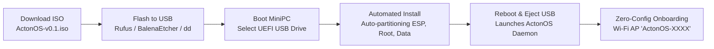

# Bare-Metal MiniPC Installation

Installing ActonOS directly on bare-metal hardware transforms an x86_64 MiniPC into a dedicated, appliance-grade AI agent server with immutable system security, kernel-level namespace sandboxing (Bubblewrap + Cgroups v2), and self-healing OTA updates.



---

## Step 1: Download the ActonOS ISO

Download the latest official ISO release from the ActonOS repository:

- **Latest Release**: `ActonOS-v0.1-amd64.iso`
- **SHA-256 Checksum**: Verify integrity before writing to media.

```bash
# Example verification in terminal
sha256sum -c ActonOS-v0.1-amd64.iso.sha256
```

---

## Step 2: Flash the ISO to a USB Drive

You will need a USB flash drive with at least **4 GB** capacity.

### Option A: Using Rufus (Windows)
1. Insert your USB flash drive.
2. Download and launch **[Rufus](https://rufus.ie/)**.
3. Select your USB drive under **Device**.
4. Click **Select** and choose `ActonOS-v0.1-amd64.iso`.
5. Under Partition scheme, select **GPT** and Target system **UEFI (non-CSM)**.
6. Click **START** and select **Write in DD Image mode** when prompted.

### Option B: Using BalenaEtcher (macOS, Windows, Linux)
1. Download and open **[BalenaEtcher](https://etcher.balena.io/)**.
2. Click **Flash from file** and select `ActonOS-v0.1-amd64.iso`.
3. Select your target USB drive.
4. Click **Flash!** and wait for verification to complete.

### Option C: Using `dd` Command (Linux / macOS CLI)

```bash
# Identify your USB drive identifier (e.g., /dev/sdb or /dev/sdc)
lsblk

# Flash the image directly (replace /dev/sdX with your actual device)
sudo dd if=ActonOS-v0.1-amd64.iso of=/dev/sdX bs=4M status=progress conv=fsync
```

---

## Step 3: Boot the MiniPC and Install

1. Insert the flashed USB drive into an available USB 3.0 port on your MiniPC.
2. Connect an Ethernet cable (optional, recommended) and power on the device.
3. Immediately press the BIOS boot menu key during power-up:
   - **Intel N100 / Beelink / Minisforum**: Usually `F7` or `F11` (or `Del` / `Esc` for BIOS setup).
   - **ASUS / ASRock**: Usually `F8` or `F11`.
   - **Lenovo / HP / Dell**: Usually `F12`.
4. Select the **UEFI: USB Flash Drive** entry from the boot menu.
5. The installer will boot into the **Automated Headless Installer**.

:::important Automated Disk Partitioning
The ActonOS automated installer will initialize the primary internal disk with the following layout:
- **Partition 1 (ESP)**: `512 MB` FAT32 UEFI Bootloader (`/boot/efi`).
- **Partition 2 (System Root)**: `4 GB` Ext4 **Read-Only** Immutable Base OS (`/`).
- **Partition 3 (User Data)**: Remaining space Ext4 Read-Write Persistent Storage (`/data`).
*Warning: All existing data on the internal target disk will be formatted.*
:::

6. The installation runs unattended for approximately 90–120 seconds.
7. Upon completion, the MiniPC will beep (or display a success screen), eject the USB drive, and reboot into ActonOS.

---

## Step 4: First-Boot Verification

Once ActonOS boots up:
- If an Ethernet cable is connected with DHCP, ActonOS will automatically obtain a LAN IP and advertise `http://acton.local` via mDNS.
- If no wired network is detected within 60 seconds, ActonOS automatically activates its **Zero-Config Wi-Fi Hotspot** (`ActonOS-XXXX`) for onboarding.

Proceed to the [Zero-Config Onboarding Guide](zero-config-onboarding) to complete initial setup.
