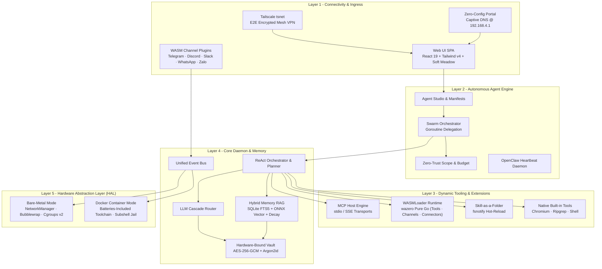

# ActonOS: The AI-Native Autonomous Operating System

**ActonOS** is a purpose-built, secure operating system and orchestration engine engineered to run autonomous AI agents and multi-agent swarms 24/7 on dedicated hardware or within containerized environments.

Unlike conventional operating systems retrofitted with AI wrappers, ActonOS places the **Agent Engine**, **WASMLoader Plugin Sandbox**, **Hardware-Bound Security Vault**, and **Hybrid Memory System** directly into the core system layer.

---

## Core Pillars & Design Principles

### 1. Dual-Runtime Hardware Abstraction Layer (HAL)
ActonOS automatically detects its environment at startup:
- **Bare-Metal MiniPC Mode**: Bootable immutable OS image on dedicated hardware (e.g., Intel N100 / AMD Ryzen). Integrates with Linux D-Bus, NetworkManager for Wi-Fi hotspot management, Bubblewrap for kernel namespace isolation, and Cgroups v2 for resource governance.
- **Docker Container Mode**: Standard Linux container packaging with a pre-configured, batteries-included development toolchain (Python, Node.js, Chromium, Ripgrep, SQLite).

### 2. Universal Agent Framework & Multi-Agent Swarm
Create unlimited AI agents with custom personas, system directives, model cascade preferences, tool scopes, and delegation budgets. Agents can operate independently or form **Swarms** where parent orchestrators decompose complex goals into dependency-aware DAGs and delegate subtasks across specialized child agents via concurrent Goroutines.

### 3. Unified WASMLoader & Dynamic Extension Engine
ActonOS provides an extensible, sandboxed extension model running on the pure-Go **Wazero JIT runtime**:
- **WASM Plugins (`.actonpkg`)**: Sandboxed WebAssembly packages for Tools, Chat Channels, and SaaS Connectors with dynamic schema configuration and Hardware Vault secret brokering.
- **Model Context Protocol (MCP)**: Native stdio and HTTP/SSE JSON-RPC client for external tool servers.
- **Skill-as-a-Folder**: Hot-reloading directory scripts containing `skill.json` and executable Bash/Python code monitored via `fsnotify`.

### 4. Hybrid Semantic Memory (RAG)
Long-term context and workspace files are indexed using a hybrid approach:
- **Lexical Search**: SQLite FTS5 with BM25 ranking for exact keyword retrieval.
- **Vector Search**: `chromem-go` local vector store paired with a dedicated loopback `embeddingd` daemon running the `multilingual-e5-small` ONNX model.
- **Cognitive Decay**: Ebbinghaus forgetting curve modeling to balance recent interactions against enduring knowledge.

### 5. Hardware-Bound Security & Immutable Filesystem
- **AES-256-GCM Vault**: Credentials, API keys, and OAuth tokens are encrypted with keys derived from hardware identifiers (DMI UUID + CPU serial) via Argon2id.
- **Sandboxed Execution**: Agent tool executions run with strict resource quotas (512 MB RAM, 50% CPU, 30 PIDs) and restricted filesystem namespaces.
- **Cryptographic Audit Ledger**: Every tool execution, token spend, and security event is appended to an immutable, SHA-256 chained audit trail (`audit.jsonl`).

### 6. Zero-Config Connectivity
- **Captive Portal**: On first boot, bare-metal MiniPCs broadcast an `ActonOS-XXXX` Wi-Fi hotspot guiding you through a 1-minute setup wizard.
- **Embedded Tailscale `tsnet`**: Secure, end-to-end encrypted remote mesh access without opening inbound firewall ports or configuring dynamic DNS.

---

## Next Steps

- Check the [System Requirements](system-requirements) to prepare your hardware or server.
- Deploy with [Docker](docker-deployment) for quick evaluation on existing infrastructure.
- Install on a [Bare-metal MiniPC](baremetal-installation) for a dedicated, appliance-grade experience.
