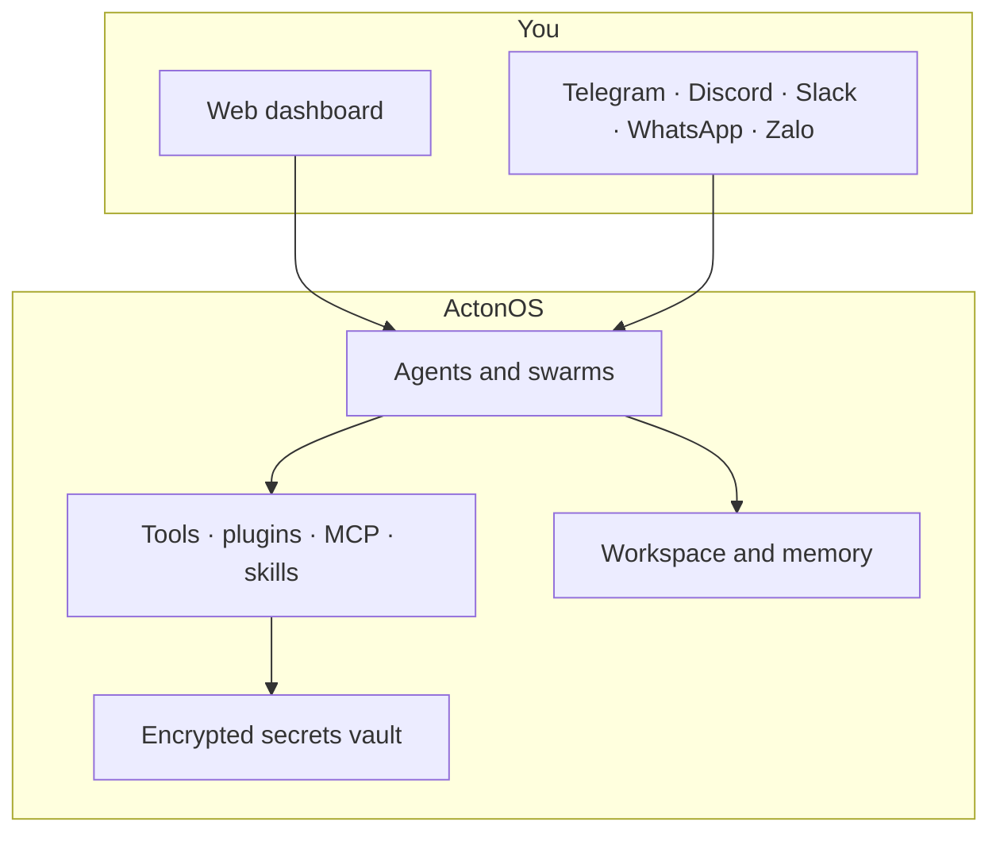

# What is ActonOS?

**ActonOS** is an AI-native operating system for running autonomous agents on a MiniPC, a home server, or Docker. You talk to agents in Chat, give them tools and files, connect them to Telegram or GitHub, and let them work in the background — with approvals, sandboxes, and encrypted secrets built in.

This documentation is for people who **use** ActonOS: install it, create agents, connect chat apps, and (if you want) write plugins. Deep internals live in [Advanced Architecture](../advanced-architecture/dual-runtime-hal).

---

## What you can do

| You want to… | Start here |
|:---|:---|
| Install and open the dashboard | [System requirements](system-requirements) → [Docker](docker-deployment) or [Bare-metal](baremetal-installation) |
| Create an agent and run a first task | [5-minute quickstart](quickstart-tutorial) |
| Chat, attach files, and save work | [Chat](../user-guide/ai-chat) and [Workspace](../user-guide/workspace) |
| Connect Telegram, Discord, Slack, WhatsApp, or Zalo | [Channels](../user-guide/channels) |
| Connect GitHub, Notion, Google Workspace, and similar apps | [Connectors](../user-guide/connectors) |
| Install or write a plugin | [Plugins](../user-guide/plugins) and [Plugin SDK](../plugin-sdk/overview) |

---

## How a typical day looks

1. Open the dashboard and check that agents, CPU, and disk look healthy.
2. Chat with an agent, attach a PDF, or ask it to write a file into **Workspace**.
3. Launch a longer **Mission** if the job needs several steps and checkpoints.
4. Let **Automations** (heartbeat / cron) handle recurring checks during work hours.
5. Receive **Notifications** when something needs your approval.

Nothing here requires you to know Go, WebAssembly, or the daemon internals.

---

## How ActonOS is put together

ActonOS is a single daemon (`actond`) plus a web UI. Agents reason, call tools, and remember files. Plugins, MCP servers, and skills add extra capabilities without restarting the OS.

The important guarantees, in plain language:

- **Two install modes**: a dedicated MiniPC image, or Docker on a machine you already have. ActonOS detects which one it is on.
- **Agents stay in a sandbox**: tools cannot freely rewrite the operating system. Risky actions pause for your approval.
- **Secrets stay encrypted**: bot tokens and API keys go into the hardware-bound vault, not a plaintext file.
- **Plugins are sandboxed**: a plugin only reaches the websites and secrets you allow in its manifest.

If you want the engineering detail, read [Dual-Runtime HAL](../advanced-architecture/dual-runtime-hal) and [Hardware Vault](../advanced-architecture/hardware-vault-security).

---

## Choose an install path

- **Try it quickly** on a laptop or existing server: [Docker deployment](docker-deployment).
- **Run it as an appliance** on a MiniPC: [Bare-metal installation](baremetal-installation) and [zero-config onboarding](zero-config-onboarding).

Then follow the [5-minute quickstart](quickstart-tutorial) to create your first agent.
