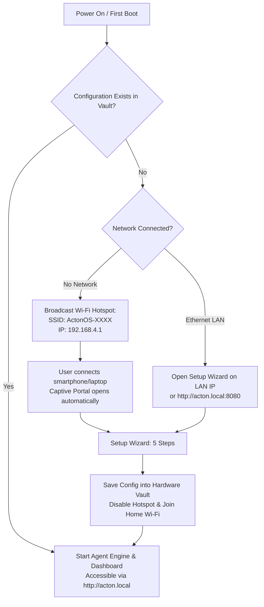

# Zero-Config Onboarding (Setup Wizard)

When booting ActonOS for the first time on a Bare-Metal MiniPC or in a new Docker environment without an existing configuration, the **Zero-Config Setup Wizard** guides you through network provisioning, LLM provider authentication, and security setup.



---

## Accessing the Setup Wizard

### Method A: Via Wi-Fi Hotspot (Captive Portal)
1. On your smartphone, laptop, or tablet, open your Wi-Fi settings.
2. Look for the network named **`ActonOS-XXXX`** (where `XXXX` corresponds to the last 4 characters of the machine's MAC address).
3. Connect to the network (no initial password required).
4. A **Captive Portal** popup will automatically open. If it does not appear automatically, open any browser and navigate to:
   ```
   http://192.168.4.1
   ```

### Method B: Via Local Area Network (LAN / Ethernet)
If your MiniPC or Docker container is connected to your router via Ethernet:
1. Open your browser on any device in the same local network.
2. Navigate to:
   ```
   http://acton.local:8080
   ```
   *(Or use the local DHCP IP assigned by your router, e.g., `http://192.168.1.150:8080`)*.

---

## The 5-Step Setup Wizard Walkthrough

The Setup Wizard presents a clean, modern interface based on the ActonOS Soft Meadow design system.

### Step 1: Wi-Fi Provisioning (Bare-Metal only)
- ActonOS scans and displays nearby 2.4 GHz and 5 GHz Wi-Fi networks.
- Select your primary home or office SSID and enter the Wi-Fi password.
- Click **Test & Connect** to ensure connectivity.

### Step 2: Configure Primary AI Model Providers
Enter API keys for the LLM providers you wish to utilize:
- **OpenAI**: `sk-proj-...` (GPT-4o, GPT-4o-mini, o1, o3-mini)
- **Anthropic Claude**: `sk-ant-...` (Claude 3.5 Sonnet, Claude 3.7 Sonnet, Claude 3.5 Haiku)
- **Google Gemini**: `AIzaSy...` (Gemini 2.0 Flash, Gemini 1.5 Pro)
- **Ollama / Local LLM**: Base URL (e.g., `http://host.docker.internal:11434` or local network IP)
- **Groq / DeepSeek / Mistral**: (Optional specialized ultra-fast providers)

:::tip Hardware-Bound Vault
All API keys entered during setup are encrypted immediately inside the system Vault (`vault.db`) using **AES-256-GCM** derived from your hardware processor serial and system UUID. Plaintext keys are never stored on disk.
:::

### Step 3: SaaS 1-Click Connectors (OAuth 2.1)
Connect essential workspace services so your agents can query emails, documents, and repositories:
- **Google Workspace**: 1-click connect to Gmail, Google Drive, Docs, and Calendar.
- **GitHub**: Authenticate to read/write issues, pull requests, and code repositories.
- **Notion**: Authorize access to task databases and knowledge workspaces.
- **Slack**: Connect agent messaging to your team channels.

### Step 4: Admin Security PIN
Set a **4-to-8 digit Admin PIN** or passphrase. This PIN protects:
- The Web Dashboard session lock.
- Administrative mutation approvals (modifying root settings, installing new tools).
- Restoring or downloading system backups.

### Step 5: Remote Access via Tailscale (Optional)
To securely access your ActonOS dashboard from outside your home network without opening firewall ports:
- Paste a [Tailscale Auth Key](https://login.tailscale.com/admin/settings/keys) (`tskey-auth-...`).
- ActonOS will spin up its embedded `tsnet` node and display your permanent `*.ts.net` domain name.

---

## Finalizing Setup

Click **Complete Setup & Launch ActonOS**. 

The system will:
1. Persist your encrypted credentials to the Hardware Vault.
2. Deactivate the `ActonOS-XXXX` Wi-Fi Hotspot and attach to your home Wi-Fi network.
3. Start the Universal Agent Engine and local background daemons.
4. Redirect you directly to the **ActonOS Dashboard**.
