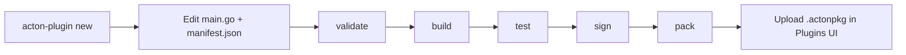

# Plugin SDK overview

The **ActonOS Plugin SDK** (`github.com/actonos/plugin-sdk`, CLI `acton-plugin` **v1.3.0**) is how you build your own extensions. You write Go, compile to WebAssembly, pack a `.actonpkg`, and upload it on the [Plugins](../user-guide/plugins) page. ActonOS runs the plugin in a sandbox. You do not restart the daemon.

This section is a **tutorial + how-to + reference** for plugin authors. If you only need to install an official package, stay on [Plugins](../user-guide/plugins).

---

## Three plugin types

| Type | `--type` flag | What it does | Typical example |
|:---|:---|:---|:---|
| **Tool** | `tool` | One or more functions an agent can call, with an auto-generated JSON schema. | Currency converter, image generator |
| **Channel** | `channel` | A chat adapter: poll or stream inbound messages, send text, typing, reactions, and files. | Telegram, Discord, Zalo |
| **Connector** | `connector` | A SaaS integration with named actions, vault tokens, and optional tool bridging. | GitHub, Notion, Linear |

A single package may declare more than one capability in `manifest.json`, but the CLI scaffolds **one** type at a time.

---

## Lifecycle



1. **Scaffold** a folder with `acton-plugin new`.
2. **Implement** handlers using `sdk.Context` (HTTP, vault, storage, logs).
3. **Declare** permissions in `manifest.json` — only the hosts and secrets you need.
4. **Build** to `dist/plugin.wasm` (`GOOS=wasip1 GOARCH=wasm`).
5. **Test** inside the bundled Wazero mock host (no live ActonOS required).
6. **Sign** with Ed25519 and **pack** a `.actonpkg`.
7. **Upload** on **Extensions → Plugins**.

---

## What the sandbox allows

The plugin cannot open arbitrary files on the host. Everything goes through host APIs:

| You call | Host does |
|:---|:---|
| `ctx.HTTP()` / `ctx.WS()` | Outbound network, filtered by `permissions.net_outbound` |
| `ctx.Vault()` | Secrets listed in `permissions.secrets` |
| `ctx.Storage()` | Isolated key-value store for this plugin id |
| `ctx.Workspace()` | Read/write **user** Workspace files (if allowed) |
| `ctx.Config()` | Settings the user filled in the generated form |
| `ctx.Log()` | Lines on the plugin **Logs** tab |
| `ctx.EventBus()` | Events listed in `permissions.bus_events` |

Asking for `"net_outbound": ["*"]` will validate with a warning. Production plugins should list real hostnames.

---

## Prerequisites {#prerequisites}

- **Go 1.26+** (native `wasip1` / `wasm` target). TinyGo is optional (`--tinygo`).
- The `acton-plugin` CLI, built from the SDK repo.

```bash
git clone https://github.com/actonos/plugin-sdk.git
cd plugin-sdk
go build -o acton-plugin ./cmd/acton-plugin/
```

On Windows the binary is `acton-plugin.exe`. Put it on your `PATH`.

---

## Where to go next

| Goal | Page |
|:---|:---|
| Build your first tool in a few minutes | [Your first plugin](first-plugin) |
| Tools in depth | [Tool plugins](tools) |
| Chat adapters, files, typing, reactions | [Channel plugins](channels) |
| OAuth / API-key SaaS actions | [Connector plugins](connectors) |
| `manifest.json`, permissions, UI schema | [Manifest and permissions](manifest) |
| Every CLI flag | [CLI reference](cli-reference) |
| Least privilege and signing | [Security](security) |
| Official channel and connector catalog | [Official plugins](official-plugins) |
| Low-level WASM imports/exports | [Host ABI](host-abi) |
