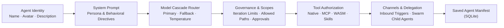

# Agent Studio & Swarm Configuration

**Agent Studio** is the visual workbench for authoring, configuring, and governing autonomous AI agents and multi-agent swarms in ActonOS.



---

## 1. Agent Identity & Persona

- **Name & Slug**: The unique identifier for the agent (e.g., `devops-architect`, `financial-analyst`).
- **Avatar / Icon**: Visual representation displayed in Chat, Operations, and Channel feeds.
- **Description**: A short summary explaining the agent's role to human users and peer agents in a Swarm.

---

## 2. System Prompt Engineering

The system prompt defines the core behavioral directives and reasoning style:

```markdown
# Role & Purpose
You are an expert DevOps engineer tasked with monitoring ActonOS services, diagnosing container health, and drafting deployment scripts.

# Operating Constraints
1. Always test commands in a dry-run mode before modifying configuration.
2. Keep temporary scripts in your private scratchpad. Publish finished documents to the user Workspace with their original names (for example `diagnostics.md`).
3. If an action requires restarting a daemon, ask for human approval.
```

:::tip Dynamic Variables
You can inject dynamic system variables into your prompts:
- `{{system.time}}` - Current system time and timezone.
- `{{system.runtime_mode}}` - Current runtime (`baremetal` or `docker`).
- `{{workspace.root}}` - Path to the persistent workspace directory.
:::

---

## 3. LLM Cascade Router

ActonOS features an intelligent model cascade router designed to maximize reliability and minimize latency/cost:

| Setting | Description | Example |
|:---|:---|:---|
| **Primary Model** | First-line model invoked for standard reasoning | `anthropic:claude-3-7-sonnet` |
| **Fallback Model 1** | Automatically invoked if the primary model encounters rate limits or errors | `openai:gpt-4o` |
| **Fallback Model 2** | Low-cost/local fallback for resilient headless execution | `google:gemini-2.0-flash` or `ollama:qwen2.5-coder` |
| **Temperature** | Controls generation randomness (0.0 = deterministic, 1.0 = creative) | `0.2` (for coding/analysis) |
| **Max Tokens** | Maximum output tokens per completion step | `4096` |

---

## 4. Governance & Tool Scopes

Define strict security boundaries for each agent:

- **Authorized Tools**: Select individual tools or use wildcard syntax:
  - `*` - Grants access to all installed tools.
  - `native_*` - Restricts access only to built-in system tools.
  - `mcp_github_*` - Restricts access to GitHub MCP tools.
- **Approval Level**:
  - `Low`: Run authorized tools without asking.
  - `Medium`: Workspace writes can run; shell, delete, cron, and extension changes still need approval.
  - `High`: Confirm every sensitive action before it runs.
- **Allowed Workspace Paths**: Restrict file read/write operations to specific subdirectories (e.g., `["docs/*", "reports/*"]`).
- **Iteration Budget**: Set the maximum number of ReAct loop steps allowed per single task (default: `25`).

---

## 5. Multi-Agent Swarm Delegation

Agents can be configured to delegate tasks to specialized child agents:

1. In the **Swarm & Delegation** section, check **Enable Agent Delegation**.
2. Select the list of allowable **Child Agents** (e.g., allow `Project Manager` to delegate to `Researcher` and `Code Writer`).
3. Set the **Delegation Budget** (maximum depth of nested agent calls, e.g., `3`).

When the orchestrator agent calls `delegate_task(target_agent, prompt)`, ActonOS spawns a concurrent Goroutine, executes the child agent within its own sandboxed context, and streams results back to the parent.
