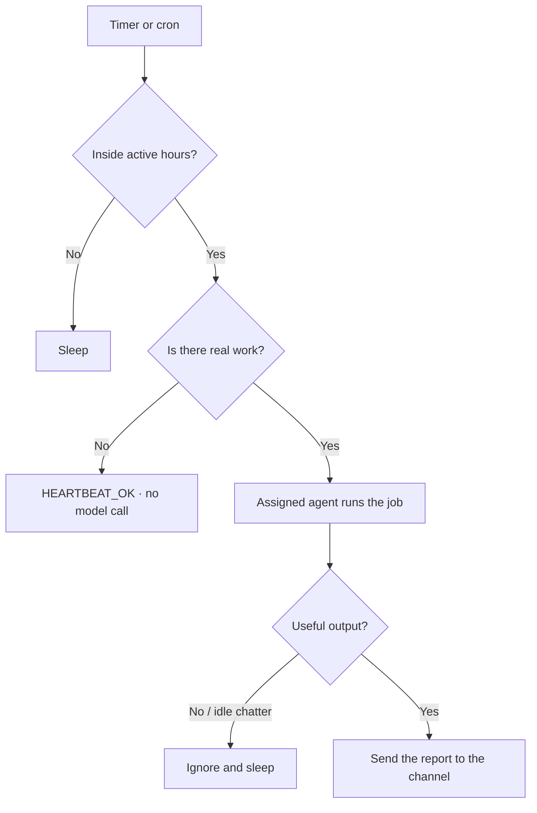

# Automations

**Automations** run standing jobs on a schedule. Between those jobs, a **heartbeat** checks whether anything actually needs an agent — so idle time does not spend tokens.

---

## Create a routine

1. Open **Automations** in the sidebar.
2. Click **+ New Automation**.
3. Enter a 5-field cron expression (for example `0 9 * * 1-5` = 09:00 on weekdays).
4. Choose an agent and write the standing instruction, such as:

   ```
   Check open GitHub pull requests, summarize reviews, and post to Slack.
   ```

5. Optionally pick a chat channel for the finished report.
6. Click **Save Automation**.

Click **Pulse Now** on the dashboard anytime you want an immediate check.

---

## How the heartbeat saves tokens



In practice:

- **Idle is free.** If the backlog is empty and `HEARTBEAT.md` has no instruction, ActonOS does **not** call a model.
- **No small talk.** Headless runs drop greetings such as “How can I help you today?”
- **Active hours.** Set a window (for example `08:00`–`22:00` in `Asia/Ho_Chi_Minh`) so overnight pulses stay quiet.
- **Cooldown.** Triggers within 15 seconds are batched into one pulse.

The design follows the [OpenClaw Heartbeat contract](https://docs.openclaw.ai/vi/gateway/heartbeat). The engineering notes are in [Hybrid Memory](../advanced-architecture/hybrid-memory-rag) only where memory is involved; heartbeat itself is this page.

---

## Related pages

- [Dashboard](dashboard) — **Pulse Now** and agent state.
- [Missions](missions) — one-off long jobs instead of cron.
- [Channels](channels) — where reports can be posted.
