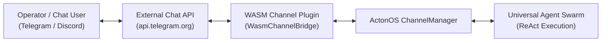

# Channels & Omnichannel Messaging

ActonOS connects AI agents to external messaging platforms (Telegram, Discord, Slack, WhatsApp, Zalo) using **WASM Channel Plugins** (`WasmChannelBridge`). This architecture decouples chat protocol implementations from the core daemon while enforcing strict sandboxing, hardware-encrypted bot tokens, and zero-trust pairing security.

---

## 1. How Channel Plugins Work

Instead of hardcoded protocol daemons, chat channels execute as sandboxed WebAssembly plugins inside the Wazero runtime:

### Key Capabilities:
- **Zero-Trust PIN Pairing**: Protects bots from unauthorized users by requiring a 6-digit numeric handshake before granting agent access.
- **Multi-Bot Accounts**: Connect multiple bots on the same platform (e.g., `@dev_support_bot` and `@ops_monitor_bot`).
- **Flexible Message Routing**: Route group chat messages by `@agent_name` mention or fallback to a default orchestrator.
- **Real-time WebSocket Streaming (`acton_ws`)**: Low-latency bidirectional streaming for Discord Gateways and Slack Socket Mode.

---

## 2. Setting Up a Channel Plugin

### Step 1: Install the Channel Plugin
1. Navigate to **Extensions** → **Plugins** in the sidebar.
2. If not already installed, upload the channel package (e.g., `channel-telegram.actonpkg` or `channel-discord.actonpkg`).

### Step 2: Configure Bot Accounts & Tokens
1. On the plugin card, click **Configure**.
2. Under **Bot Accounts**, click **+ Add Account**.
3. Fill in the required parameters:
   - **Account ID**: Unique identifier (e.g., `tg_dev_bot`).
   - **Bot Token**: Obtained from [@BotFather](https://t.me/botfather) or Discord Developer Portal.
   - **Default Agent**: Select the target agent that responds to incoming messages.
   - **Routing Mode**:
     - `exclusive`: Only assigned agents receive messages.
     - `mention`: Group messages are routed to agents tagged with `@agent_name`.
     - `fallback`: Routes unassigned messages to the system core agent.
4. Click **Save Changes**. The token is encrypted inside the **Hardware Vault** (`vault.db`) and the plugin hot-reloads instantly.

---

## 3. Operator Security & Pairing PIN Handshake

When a new user sends a message to an ActonOS bot for the first time, the system initiates a zero-trust authorization handshake:

1. The bot replies with a one-time **6-digit pairing code** (e.g., `842-195`).
2. The user/administrator navigates to **System** → **Settings** (or the Pairing modal) in the ActonOS Web UI.
3. Enter the 6-digit PIN to authorize the user ID.
4. Once verified, the sender's identity is permanently recorded in the authorization ledger, and subsequent messages are processed directly by the assigned agent swarm.

---

## 4. Channel Health Monitoring & Auto-Recovery

ActonOS continuously monitors the runtime health of all active channel adapters:
- **Long-Polling & WebSocket Watchdog**: If a polling loop stalls or a socket disconnects, the daemon automatically initiates reconnection with exponential backoff.
- **Health Badges**: The Plugins and Operations dashboards display real-time statuses: 🟢 `Connected`, 🟡 `Reconnecting`, or 🔴 `Error`.
- **Failure Escalation**: If a token is revoked or rate-limited by the upstream provider, ActonOS generates an immediate notification in the Notification Center with actionable diagnostic logs.
