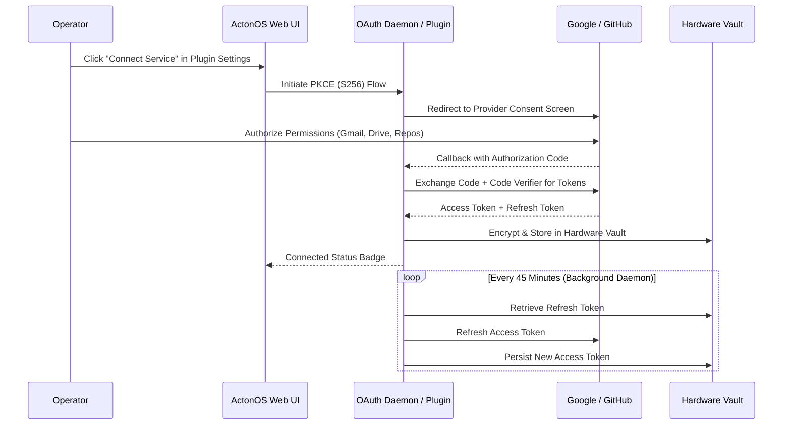

# SaaS Connectors & OAuth 2.1

The **Connectors** framework enables ActonOS agents to safely access cloud productivity suites and developer platforms via **WASM Connector Plugins** (`WasmConnectorBridge`) using industry-standard **OAuth 2.1 PKCE (S256)** without storing long-lived plaintext passwords.

---

## 1. Supported SaaS Connector Plugins

Every connector plugin bundles typed actions that automatically bridge into ReAct Agent Tools (`conn.AsTools()`):

| Provider Plugin | Supported Agent Capabilities | Bridged Tools |
|:---|:---|:---|
| **Google Workspace** | Read/search Gmail, create calendar events, read/write Google Drive files. | `google_mail_search`, `google_calendar_create`, `google_drive_read` |
| **GitHub** | Search code, list/create issues, open pull requests, review commits. | `github_list_repos`, `github_create_issue`, `github_open_pr` |
| **Notion** | Query databases, create pages, update task boards. | `notion_query_database`, `notion_create_page` |
| **Slack** | Read channel history, post rich message cards, upload files. | `slack_post_message`, `slack_read_history` |
| **Linear** | Manage issues, search projects, update sprint cycles. | `linear_search_issues`, `linear_create_issue` |

---

## 2. Setting Up a Connector Plugin

1. Navigate to **Extensions** → **Plugins** in the left sidebar.
2. Choose your desired SaaS plugin (e.g., **GitHub Connector**) and click **Configure**.
3. Provide your OAuth 2.1 `Client ID` and `Client Secret` (stored securely in Hardware Vault).
4. Click **Connect Account**. A popup window will prompt you to authenticate with the third-party provider and approve requested permission scopes.
5. Upon authorization, ActonOS exchanges the code for tokens and encrypts them into `/data/config/vault.db`.
6. The status changes to 🟢 **Connected**, and bridged tools immediately become callable by authorized agents.

---

## 3. Background Token Refresh Daemon

- ActonOS runs an automated token refresh daemon that inspects token expiration timestamps every 5 minutes.
- Expiring access tokens are automatically refreshed in the background before they expire.
- If a token refresh fails (e.g., user revoked permissions in their account settings), ActonOS marks the connector as 🔴 **Re-authentication Required** and dispatches a notification alert.
