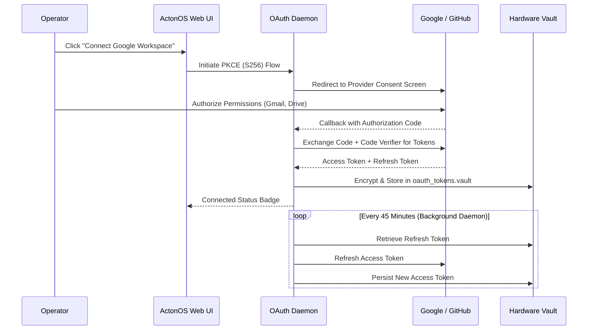

# SaaS Connectors & OAuth 2.1

The **Connectors** framework enables ActonOS agents to safely access cloud productivity suites and developer services via **OAuth 2.1 PKCE (S256)** without storing long-lived plaintext passwords.

---

## 1. Supported 1-Click Connectors

| Provider | Supported Agent Capabilities | Scopes Required |
|:---|:---|:---|
| **Google Workspace** | Read/search Gmail, create calendar events, read/write Google Drive docs and spreadsheets | `gmail.readonly`, `gmail.send`, `drive.file`, `calendar.events` |
| **GitHub** | Search code, list/create issues, open pull requests, review commits | `repo`, `read:user`, `workflow` |
| **Notion** | Query databases, create pages, update task boards | `read_content`, `update_content` |
| **Slack** | Read channel history, post rich message cards, upload files | `channels:history`, `chat:write` |

---

## 2. Setting Up a Connector

1. Navigate to **Connectors** in the left sidebar.
2. Choose the service you wish to link (e.g., **GitHub**).
3. Click **Connect Service**.
4. A popup window will prompt you to authenticate with the third-party provider and approve requested permission scopes.
5. Upon authorization, ActonOS securely exchanges the OAuth code for an access token and refresh token.
6. The status changes to 🟢 **Connected**, and registered agent tools immediately gain access.

---

## 3. Background Token Refresh Daemon

- ActonOS runs a background token refresh daemon that inspects token expiration timestamps every 5 minutes.
- Expiring access tokens are automatically refreshed in the background before they expire.
- If a token refresh fails (e.g., user revoked permissions in their Google account settings), ActonOS marks the connector as 🔴 **Re-authentication Required** and dispatches a notification alert.
