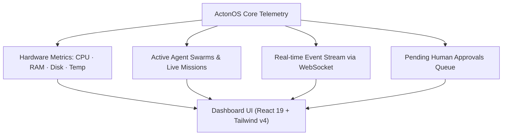

# Dashboard & System Observability

The **ActonOS Dashboard** serves as the primary cockpit for monitoring agent activity, system telemetry, resource consumption, and background automations in real time.

---

## 1. Top Telemetry Bar

The top telemetry header provides a continuous pulse on the physical or containerized host:

- **CPU Usage Gauge**: Real-time multi-core processor load, updated every 2 seconds via WebSocket snapshot.
- **RAM Allocation**: Active memory consumption vs. total physical capacity (e.g., `1.8 GB / 16 GB`).
- **Disk Storage**: Used vs. available storage on the persistent `/data` volume.
- **HAL Mode Badge**: Displays whether the system is running in `Bare-metal (bwrap)` or `Docker Container` mode.
- **Chip Temperature (Bare-metal)**: Direct thermal sensor readout from the motherboard D-Bus interface.

---

## 2. Active Agents Overview

The central cards display all currently registered agents:
- **Agent Avatar & Name**: Quick-glance identification.
- **State Indicator**:
  - 🟢 `Idle` - Agent is awaiting input or scheduled pulse.
  - 🟡 `Executing Tool` - Agent is actively calling an MCP, WASM, or Native tool.
  - 🟣 `Delegated` - Agent is coordinating subtasks across a child swarm.
  - 🔴 `Approval Required` - Agent execution is paused awaiting human clearance.
- **Quick Action**: Click any agent card to jump directly into a dedicated Chat session or open its configuration in **Agent Studio**.

---

## 3. Global Command Palette (`Ctrl + K`)

Press **`Ctrl + K`** (or **`Cmd + K`** on macOS) from anywhere within ActonOS to launch the Omnisearch Command Palette:

- **Quick Navigation**: Jump instantly to any page (`Chat`, `Missions`, `Connectors`, `Settings`, `Terminal`).
- **Agent Direct Search**: Type an agent name to initiate an immediate chat session.
- **File Locator**: Locate and open files in the Workspace without navigating the folder tree.
- **Quick Actions**: Trigger manual **System Backup**, **Heartbeat Pulse**, or **Session Lock**.

---

## 4. Pending Approvals Banner

When an autonomous agent attempts a high-risk mutation (such as modifying system files, executing unknown shell commands, or sending outbound email broadcasts), an amber alert banner appears across the dashboard:

- **Action Preview**: Displays the exact tool name, target path/URL, and parameter payload.
- **Approving / Rejecting**: Click **Approve** (with optional audit reason) to resume execution from its exact checkpoint, or **Reject** to abort the action safely.
