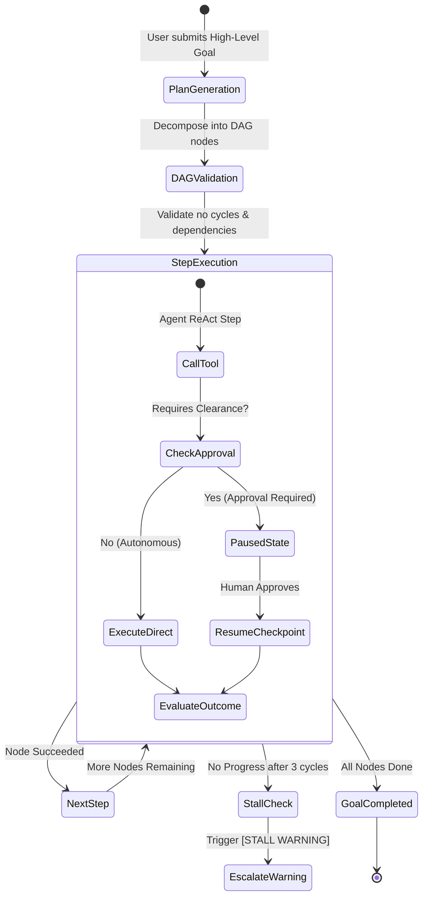

# Autonomous Missions & Goal Execution

The **Missions** engine enables ActonOS agents to execute complex, multi-stage objectives autonomously over extended durations while maintaining durable state, dependency tracking, and human-in-the-loop oversight.

---

## 1. Defining a Mission Goal

To create a new mission:
1. Navigate to **Missions** in the left sidebar.
2. Click **+ Launch Mission**.
3. Fill in the mission parameters:
   - **Goal Directive**: The primary high-level objective (e.g., `Audit the /workspace/src codebase for security vulnerabilities, generate a comprehensive report in /workspace/docs/security_audit.md, and open a GitHub issue with the summary`).
   - **Assigned Agent**: Select the primary orchestrator agent (e.g., `Security Engineer`).
   - **Priority**: `Low`, `Standard`, `High`, or `Critical`.
   - **Target Channel Notification**: Optional channel (e.g., `Telegram - Dev Channel`) to notify upon completion.

---

## 2. Dependency-Aware DAG Execution

When a mission begins, the `Planner` decomposes the goal into a Directed Acyclic Graph (DAG):
- **Node Validation**: Rejects duplicate nodes, unknown dependencies, and circular loops.
- **Ordered Sequencing**: Independent subtasks run concurrently; dependent subtasks await prerequisite outputs.
- **Live Progress Matrix**: The UI visualizes task states: `Pending`, `Running`, `Completed`, `Blocked`, or `Failed`.

---

## 3. Durable Checkpointing & Resumption

Every state transition and intermediate output is persisted in `agent_runs.checkpoint_json`:

- **Fault Tolerance**: If the host experiences a power outage or container restart, ActonOS automatically resumes active missions from their last committed checkpoint without re-running completed steps.
- **Paused Approvals**: When a tool requires clearance, the entire execution state (messages, token counters, pending tool payload) is frozen. Once approved via the dashboard or API, the exact step executes immediately.

---

## 4. Stall Detection & Auto-Escalation

To prevent infinite loops and wasted token budgets, ActonOS includes built-in **Stall Tracking**:
- If an agent generates identical progress metrics (`[PROGRESS: X%]`) or repeats repetitive tool calls for 3 consecutive cycles without advancing the DAG, the engine emits a **`[STALL WARNING]`**.
- The warning is logged to the mission feed and surfaced as a high-priority notification to the operator.
- The operator can provide steering instructions via chat or pause the mission safely.
