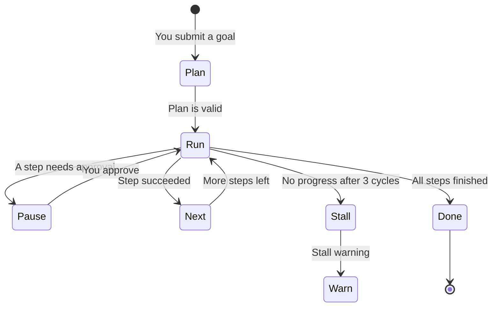

# Missions

A **Mission** is a longer job with a written goal, a plan of steps, and checkpoints. Use it when a chat message is not enough — for example “audit this project, write `security_audit.md`, and open a GitHub issue.”

---

## Launch a mission

1. Open **Missions** in the sidebar.
2. Click **+ Launch Mission**.
3. Fill in:
   - **Goal** — the outcome you want, including file names.
   - **Agent** — the orchestrator (for example `Security Engineer`).
   - **Priority** — Low, Standard, High, or Critical.
   - **Notify** — optional chat channel when it finishes.
4. Start the mission.

ActonOS breaks the goal into a step graph: independent steps can run together; dependent steps wait. The UI shows each step as Pending, Running, Completed, Blocked, or Failed.

---

## If the machine restarts

Every completed step is saved. After a power cut or container restart, the mission continues from the last checkpoint instead of starting over.

If a tool needs approval, the mission freezes (messages, counters, and the pending action). Approve from the [Dashboard](dashboard) or [Notifications](notifications) and that exact step continues.

---

## Stall warnings

If the agent repeats the same progress or the same tools for **three cycles** without moving the plan forward, ActonOS raises a stall warning.

You can then:

- Send a steering message in Chat.
- Pause the mission.
- Adjust tools or the goal and resume.

---

## Related pages

- [Agent Studio](agent-studio) — pick the orchestrator and its tools.
- [Dashboard](dashboard) — approve paused steps.
- [Live Operations](operations) — watch logs while it runs.
