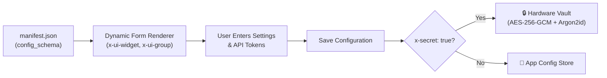

# Plugins & WASM Extensions

ActonOS features a unified **WebAssembly (WASM) Plugin System** running on the pure-Go **Wazero JIT runtime**. Through the dedicated **Plugins** page (`/plugins`), operators can discover, install, configure, and monitor sandboxed extensions that add new **Agent Tools**, **Chat Channels**, and **SaaS Connectors** to the operating system without restarting the daemon.

---

## 1. Unified Plugin Capabilities

Every plugin package defines one or more operational capabilities:

| Capability | Purpose | Host Execution Bridge | Example Integrations |
|:---|:---|:---|:---|
| 🔧 **Tool** | Exposes callable function tools to ReAct Agent swarms. | `WasmToolBridge` $\rightarrow$ `ToolRegistry` | Weather API, Web Scraper, SQL runner, Code Formatter |
| 💬 **Channel** | Connects external chat protocols with multi-bot accounts and message routing. | `WasmChannelBridge` $\rightarrow$ `ChannelManager` | Telegram Bot, Discord Bot, Slack App, WhatsApp, Zalo |
| 🔗 **Connector** | Connects SaaS platforms, manages OAuth 2.1 credentials, and bridges actions as tools. | `WasmConnectorBridge` $\rightarrow$ `ToolRegistry` | GitHub, Notion, Linear, Google Workspace |

---

## 2. Installing a Plugin

ActonOS supports two distribution formats:
- **`.actonpkg`**: The standard bundle containing `manifest.json`, compiled `plugin.wasm`, icons, and schemas.
- **`.wasm`**: Raw compiled WebAssembly binaries targeting WASI (`wasip1`).

### Installation Steps:
1. Navigate to **Extensions** → **Plugins** in the sidebar.
2. Click the yellow **+ Upload Plugin** button in the top right.
3. Drag and drop your `.actonpkg` or `.wasm` file into the upload zone (or click to browse).
4. Review the requested permissions summary:
   - **Outbound Domains**: Whitelist of hostnames the plugin is allowed to contact via HTTP (`permissions.net_outbound`).
   - **Vault Secrets**: Keys the plugin is authorized to retrieve (`permissions.secrets`).
   - **Persistent Storage**: Whether the plugin has access to an isolated SQLite key-value partition.
5. Click **Install & Activate**. The plugin immediately initializes within the Wazero sandbox runtime.

:::tip Automatic Hot-Reload
ActonOS loads and starts the WebAssembly instance instantaneously. No daemon reboot or service downtime is required.
:::

---

## 3. Dynamic Configuration & Hardware Vault Security

When a plugin declares a `config_schema` in its `manifest.json`, ActonOS renders an interactive configuration form dynamically:

### Key UI Features:
- **Collapsible Groups (`x-ui-group`)**: Fields are organized into logical sections (e.g., *General Settings*, *Bot Accounts*).
- **Hardware-Encrypted Secrets (`x-secret: true`)**: Sensitive tokens (like Discord bot tokens or API keys) are stored directly in the **Hardware Vault** (`vault.db`). The sandboxed plugin only receives decrypted tokens dynamically at runtime.
- **Multi-Account Repeaters**: For chat channels, you can add multiple bot accounts, assign independent token credentials, and bind each bot to a specific target Agent.

---

## 4. Real-time Sandboxed Logs & Diagnostics

Each running WASM plugin outputs structured logs via the `acton_sys: log` host syscall.

### Viewing Logs:
1. In the **Plugins** list, find your target plugin card.
2. Click the **View Logs** button (or click the card and switch to the **Logs** tab).
3. A live streaming log console displays:
   - **Timestamp & Level**: `[INFO]`, `[WARN]`, `[DEBUG]`, `[ERROR]`.
   - **Linear Memory Consumption**: Live tracking of allocated WebAssembly heap memory.
   - **Outbound HTTP Calls**: Audited egress network requests.

---

## 5. Lifecycle Management: Enable, Disable & Delete

- **Enable / Disable Toggle**: Toggle a plugin off to pause its event loops and unregister its tools without losing saved configurations or Vault secrets. Toggle back on to resume instantly.
- **Hot Configuration Updates**: Editing parameters in the configuration modal immediately signals the Wazero sandbox to refresh runtime context without interrupting other active agents.
- **Clean Uninstall**: Clicking **Uninstall Plugin** gracefully stops active connections, unbinds registered tools and channels, removes the plugin directory from `/data/plugins/{id}`, and purges isolated KV storage.
