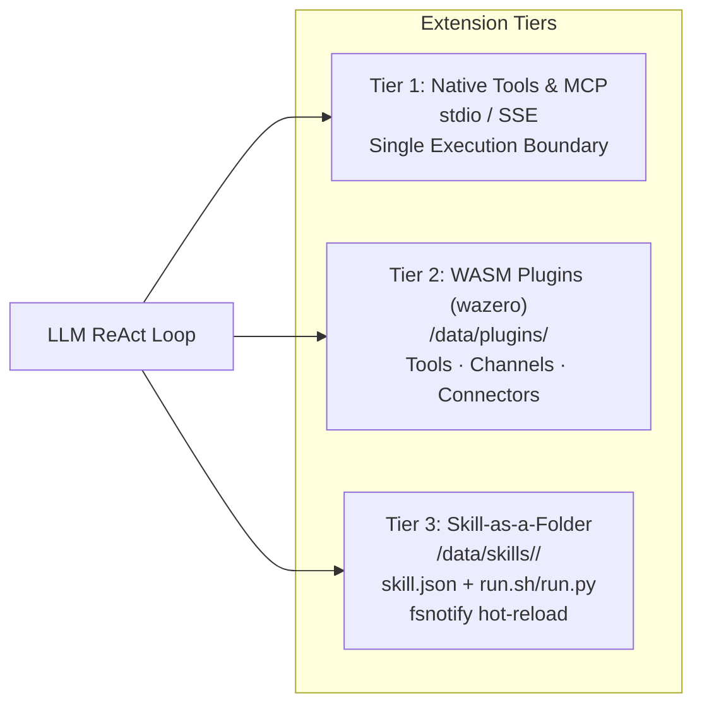

# Tools, MCP & Skill Runtimes

ActonOS provides an extensible, multi-protocol execution engine organized into 3 distinct extension tiers: **Tier 1 (Native Tools & MCP Servers)**, **Tier 2 (Unified WASM Plugins)**, and **Tier 3 (Skill-as-a-Folder Scripts)**.



---

## 1. Tier 1: Native Built-in Tools & MCP Servers

### Native Tools
Pre-compiled directly into the `actond` static binary for maximum speed:
- `native_web_search`: Query DuckDuckGo, Brave Search, or Tavily for current web information.
- `native_browser_navigate` & `native_browser_screenshot`: Open a page in headless Chromium, extract rendered text, or capture a screenshot.
- `native_workspace_search`, `native_workspace_read`, `native_workspace_write`, `native_workspace_delete`: Work with **your** documents on the Workspace page. Files keep their original names (`report.pdf`). For PDFs and other binaries, the agent opens them by name instead of dumping the whole file into chat.
- `native_file_read` / `native_file_write`: The agent’s **private scratchpad** (temporary scripts and in-progress work). These files are not listed on the Workspace page until they are published with `native_workspace_write`.
- `native_exec`: Execute shell commands inside the isolated Bubblewrap/Subshell sandbox. User documents are available by original name under `user-workspace/` (environment variable `ACTONOS_USER_WORKSPACE`).
- `native_channel_notify`: Send a text message **or a workspace file** through an installed chat plugin (Telegram, Discord, Slack, WhatsApp, Zalo). ActonOS only forwards the file; the plugin uploads it. Pick a specific channel when attaching a file.

### Model Context Protocol (MCP) Integration
ActonOS acts as a native MCP Host implementing the open standard by Anthropic:
- **`stdio`**: Spawns local CLI binaries or containerized processes communicating over stdin/stdout JSON-RPC.
- **`http` / `sse`**: Connects to remote or network-accessible MCP endpoints over Server-Sent Events.
- Sensitive environment variables are stored in the Hardware Vault under `mcp.env.<id>`.

---

## 2. Tier 2: Unified WASM Plugins (WASMLoader)

High-performance, polyglot extensions compiled to WebAssembly (`wasip1` / `wasm32-wasi`) running on the pure-Go **Wazero JIT runtime**:
- **Sandboxed Execution**: Isolated linear memory instances with zero host file system access except through host syscalls.
- **Egress Firewall**: Network requests are strictly constrained to hostnames whitelisted in `manifest.permissions.net_outbound`.
- **Capabilities**: Unifies **Agent Tools**, **Chat Channels**, and **SaaS Connectors** into standardized `.actonpkg` packages.

---

## 3. Tier 3: Skill-as-a-Folder Architecture

Users and developers can author custom lightweight skills simply by creating a directory inside `/data/skills/`:

```
/data/skills/my_custom_skill/
├── skill.json      # Tool schema & parameter definitions
└── run.sh          # Executable script (or run.py)
```

### Hot-Reloading with `fsnotify`
The ActonOS skill watcher monitors `/data/skills/`. Creating, editing, or deleting a skill directory triggers an automatic registration update without requiring a daemon restart.
