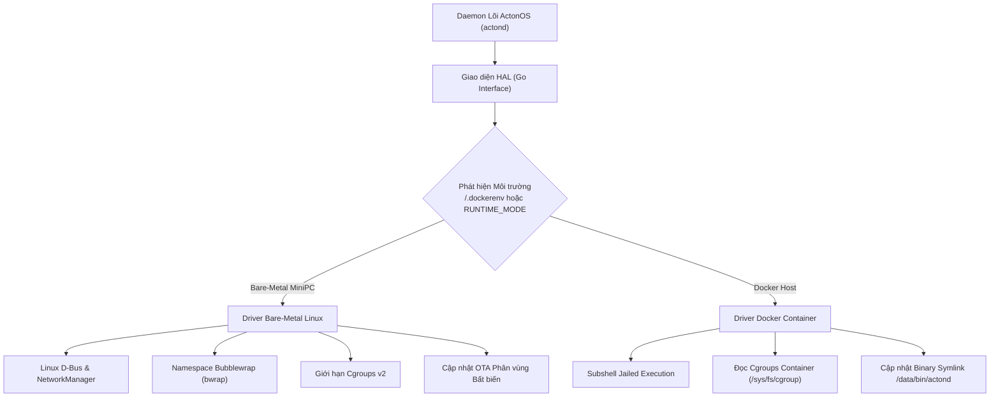

# Lớp Trừu tượng Phần cứng Kép (Dual-Runtime HAL)

Tầng **Hardware Abstraction Layer (HAL)** là nền tảng cốt lõi cho phép ActonOS hoạt động liền mạch và đồng nhất trên cả phần cứng MiniPC vật lý lẫn trong môi trường Docker Container.

---

## 1. Cơ chế Tự động Nhận diện Môi trường

Khi khởi động, daemon `actond` kiểm tra các dấu hiệu:
1. Tồn tại file `/.dockerenv` hoặc biến môi trường `RUNTIME_MODE=docker`.
2. Kiểm tra quyền truy cập D-Bus hệ thống (`/var/run/dbus/system_bus_socket`).
3. Xác định số hiệu PID 1 (`/proc/1/comm`).

---

## 2. So sánh Chức năng giữa Hai Chế độ

| Tính năng | Chế độ Bare-Metal MiniPC | Chế độ Docker Container |
|:---|:---|:---|
| **Mạng & Wi-Fi Hotspot** | D-Bus NetworkManager (Tự động phát sóng Captive Portal) | Cổng Host Port / Docker Bridge Network |
| **Cách ly Thực thi Mã** | Bubblewrap Namespaces + Cgroups v2 | Subshell Jailing + Non-root `acton` user |
| **Bảo mật Két (Vault)** | DMI UUID + CPU Serial + Argon2id | Machine-ID Container / Random Secret Key |
| **Truy cập Từ xa** | Tích hợp sẵn `tsnet` WireGuard node | Tích hợp sẵn `tsnet` hoặc mạng Tailscale của máy chủ |
| **Cơ chế Cập nhật OTA** | Atomic Symlink `/data/bin/actond` + Watchdog 30s | Đổi tag image Docker mới hoặc cập nhật binary nội bộ |
