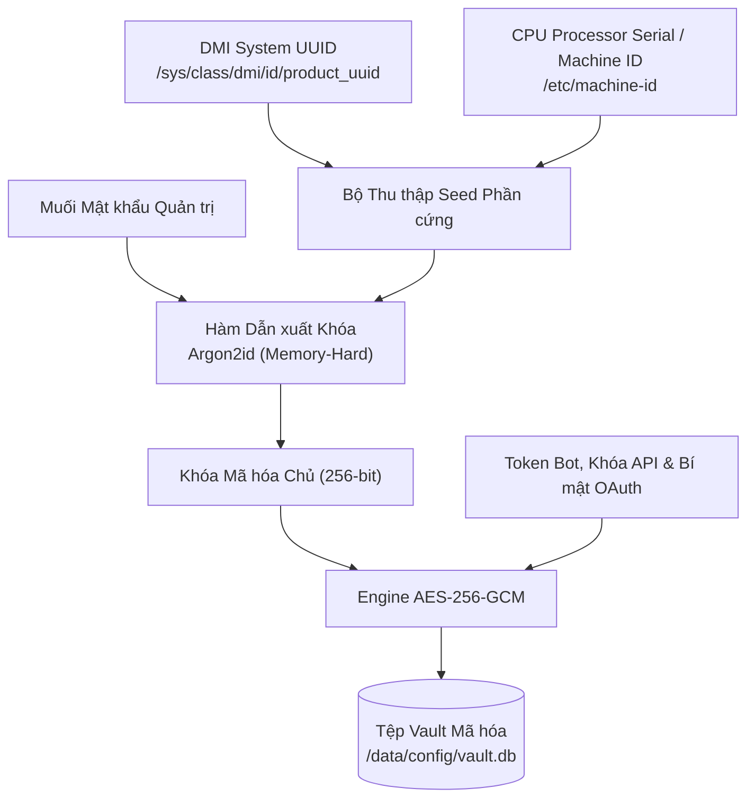
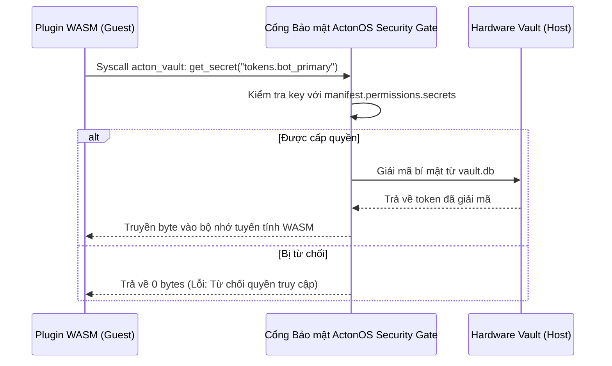

# Két Bảo mật Phần cứng & Mật mã học

ActonOS triển khai hệ thống lưu trữ thông tin xác thực theo mô hình Zero-Trust, trong đó các khóa bí mật nhạy cảm, API key, token bot chat và OAuth refresh token đều được mã hóa ở trạng thái tĩnh bằng thuật toán **AES-256-GCM** với khóa chủ được dẫn xuất mật mã trực tiếp từ định danh phần cứng vật lý và muối mật khẩu quản trị.



---

## 1. Dấu vân tay Phần cứng & Dẫn xuất Khóa

Trên các máy chủ Bare-Metal, Hardware Vault dẫn xuất khóa gốc từ:
1. **DMI System UUID**: Định danh phần cứng duy nhất từ BIOS bo mạch chủ.
2. **System Machine ID**: Định danh CPU và phần cứng máy chủ.
3. **Argon2id KDF**: Hàm dẫn xuất khóa tốn bộ nhớ (64 MB RAM, 4 vòng lặp song song).

:::important Chống Trộm Ổ Cứng & Nhân Bản Đĩa
Nếu kẻ tấn công tháo ổ cứng NVMe SSD hoặc sao chép ảnh đĩa sang máy khác, khóa phần cứng dẫn xuất sẽ không khớp, khiến toàn bộ dữ liệu trong `/data/config/vault.db` trở nên hoàn toàn không thể giải mã.
:::

---

## 2. Cầu nối Phân phối Bí mật cho Plugin WASM

Các plugin WASM không bao giờ được phép đọc trực tiếp tệp `/data/config/vault.db` hay tiếp cận Master Key. Việc lấy thông tin xác thực tuân thủ mô hình môi giới bảo mật (Broker Pattern):



- **Khai báo Manifest**: Plugin bắt buộc phải khai báo mẫu khóa bí mật cần dùng trong `manifest.permissions.secrets` (ví dụ: `["discord_bot_tokens.*"]`).
- **Phân quyền RBAC Chặt chẽ**: Yêu cầu đọc các khóa ngoài danh mục cấp phép sẽ bị từ chối ngay lập tức và ghi lại trong nhật ký kiểm toán an ninh.

---

## 3. Sổ cái Kiểm toán Chuỗi Băm Mật mã (`audit.jsonl`)

Mọi sự kiện nhạy cảm (gọi công cụ, phê duyệt/từ chối hành động, làm mới token, đăng nhập) đều được lưu vào tệp nhật ký chỉ ghi nối tiếp (append-only) có tính bảo mật tiến:

```
Hash(n) = SHA-256(Hash(n-1) || Timestamp(n) || EventPayload(n))
```

Hệ thống cung cấp API kiểm tra toàn vẹn (`GET /api/system/audit/verify`) để quét toàn bộ chuỗi băm từ bản ghi khởi tạo, giúp phát hiện ngay mọi hành vi sửa đổi hoặc xóa nhật ký trái phép.
