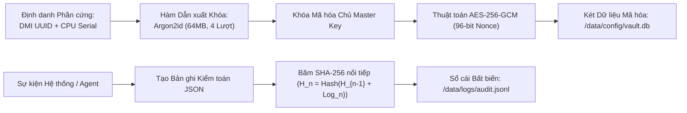

# Két Bảo mật Ràng buộc Phần cứng & Sổ cái Kiểm toán

Trong ActonOS, toàn bộ bí mật, API key và OAuth tokens được bảo vệ bằng mô hình **Zero-Trust Hardware-Bound Vault** kết hợp với **Sổ cái Kiểm toán Bất biến (SHA-256 Chained Audit Trail)**.

---

## 1. Cơ chế Ràng buộc Phần cứng (Hardware Binding)

- **Sinh khóa**: Khi thiết lập lần đầu, hệ thống đọc DMI UUID (`/sys/class/dmi/id/product_uuid`) và CPU Serial từ phần cứng.
- **Argon2id**: Khóa chủ được dẫn xuất qua Argon2id với bộ nhớ 64 MB, 4 lượt tính toán và muối (salt) hệ thống ngẫu nhiên.
- **Chống Trộm Ổ Cứng**: Nếu tháo ổ SSD mang sang máy tính khác, khóa không thể giải mã được vì khác mã phần cứng.

---

## 2. Sổ cái Kiểm toán Nối chuỗi Băm (SHA-256 Ledger)

Mọi thao tác thay đổi cấu hình, tiêu thụ token và gọi công cụ đều được ghi vào `/data/logs/audit.jsonl`.
Mỗi dòng log chứa mã hash của dòng trước đó:
- Nếu ai đó cố tình xóa hoặc sửa một dòng trong quá khứ, toàn bộ chuỗi băm sẽ bị gãy và hệ thống sẽ báo động vi phạm tính toàn vẹn.
