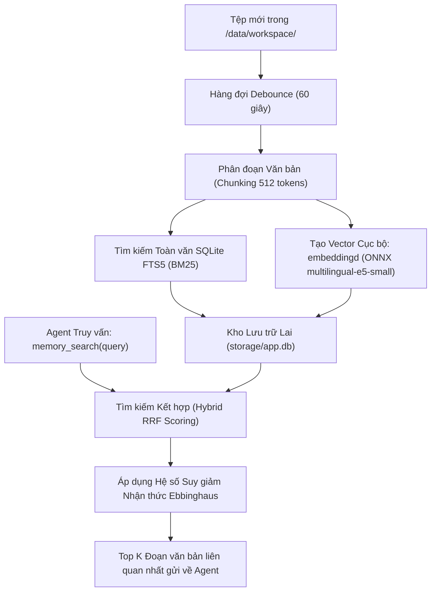

# Bộ nhớ Ngữ nghĩa Lai & Cơ chế RAG

ActonOS tích hợp hệ thống **Bộ nhớ Ngữ nghĩa Lai (Hybrid RAG)**, kết hợp giữa tìm kiếm từ khóa chính xác (FTS5) và tìm kiếm ngữ nghĩa sâu (Vector Embeddings) cùng thuật toán suy giảm nhận thức Ebbinghaus.



---

## 1. Công thức Suy giảm Nhận thức Ebbinghaus

Để cân bằng giữa kiến thức mới và dữ liệu cũ, ActonOS áp dụng công thức:

```
R(t) = exp(-t / S)
```
Trong đó:
- $t$: Thời gian đã trôi qua kể từ lần tương tác gần nhất.
- $S$: Độ bền ghi nhớ của đoạn dữ liệu (tự động tăng khi Agent tái sử dụng đoạn thông tin đó nhiều lần).

---

## 2. Mô hình Vector Cục bộ Hoàn toàn (Embedding Daemon)

- Sử dụng mô hình ONNX siêu nhẹ **`multilingual-e5-small`** (chỉ 130 MB RAM).
- Chạy trực tiếp trên CPU qua daemon `embeddingd`, không cần GPU rời và không gửi dữ liệu ra bên ngoài.
