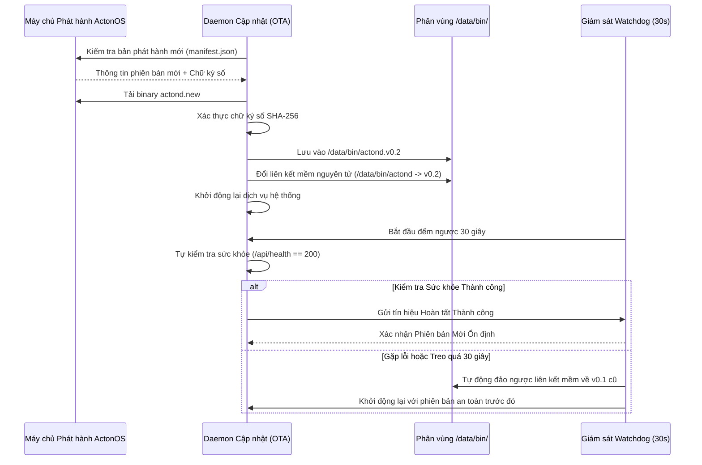

# Hệ điều hành Bất biến & Cập nhật OTA Tự phục hồi

ActonOS sử dụng kiến trúc **Hệ điều hành Bất biến (Immutable OS)** kết hợp cơ chế hoán đổi liên kết mềm nguyên tử (**Atomic Symlink Swap**) và **Bộ theo dõi Sức khỏe (30-second Watchdog)** để đảm bảo an toàn tuyệt đối khi nâng cấp phần mềm từ xa.

---

## 1. Không Bao giờ Bị Lỗi Hệ Thống (Zero-Bricking)

- **Phân vùng Gốc Chỉ Đọc**: Không thể bị ghi đè hay hỏng do virus hoặc lỗi phần mềm.
- **Tự Động Rollback**: Nếu bản cập nhật mới gặp lỗi không thể khởi động trong vòng 30 giây, Watchdog sẽ tự động khôi phục về phiên bản trước đó ngay lập tức.
