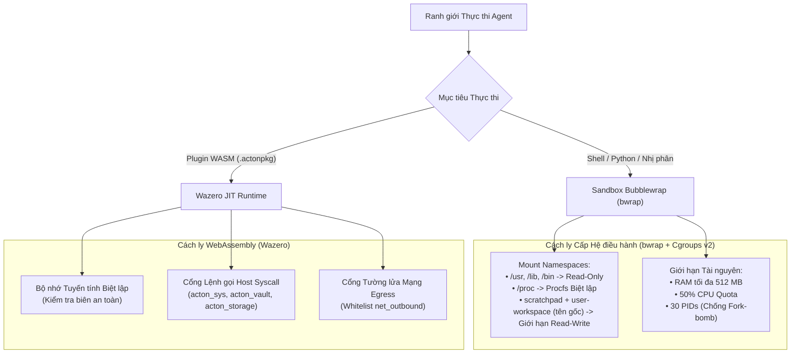

# Cách ly Sandbox & Bảo mật Đa tầng

Nhằm cho phép các AI Agent và Plugin thực thi an toàn các đoạn mã chưa được kiểm duyệt, biên dịch phần mềm và chạy các tích hợp ngoài, ActonOS áp dụng cơ chế cách ly đa tầng nghiêm ngặt kết hợp giữa **Bubblewrap (`bwrap`)**, **Linux Control Groups (Cgroups v2)** và **Môi trường Sandbox WebAssembly Wazero**.

---

## 1. Cách ly Môi trường WebAssembly (WASM Sandbox)

Toàn bộ plugin (`.actonpkg` / `.wasm`) thực thi bên trong engine **Wazero WebAssembly JIT** thuần Go:
- **An toàn Bộ nhớ Tuyến tính**: Plugin hoàn toàn không thể truy xuất bộ nhớ ngoài không gian heap tuyến tính được cấp phát riêng.
- **Chặn Socket Thô**: Các lệnh gọi socket TCP/UDP trực tiếp bị khóa ở ranh giới WASI. Mọi truy cập mạng bắt buộc phải qua syscall `acton_net: http_request` hoặc `acton_ws: ws_*`.
- **Tường lửa Tên miền Egress**: Lưu lượng HTTP ra ngoài được kiểm duyệt đối chiếu với danh sách `manifest.permissions.net_outbound`. Bất kỳ yêu cầu nào đến domain chưa cấp quyền đều bị từ chối lập tức.
- **Cầu nối Bí mật Hardware Vault**: Plugin không bao giờ đọc khóa mã hóa trực tiếp; các yêu cầu lấy token đều đi qua syscall `acton_vault` và kiểm tra quyền trong `permissions.secrets`.

---

## 2. Cách ly Tiến trình & Tệp Cấp Hệ điều hành (Bubblewrap)

Dành cho các lệnh shell (`native_exec`), trình biên dịch và script Python:
- **Tệp Nhị phân Hệ thống**: `/usr`, `/lib`, `/lib64`, và `/bin` được gắn kết ở chế độ **Read-Only**.
- **Thư mục Nhạy cảm**: `/etc`, `/root`, `/home`, và `/data/config` (chứa khóa Vault) bị **ẩn hoàn toàn** không thể truy cập.
- **Truy cập Workspace**: Tài liệu của người dùng mở được theo **tên gốc** (ví dụ `report.pdf`) qua góc nhìn `user-workspace/` và biến môi trường `ACTONOS_USER_WORKSPACE`. Thư mục tạm riêng của agent là vùng ghi khác. Đường dẫn cấu hình host và Vault vẫn bị ẩn.
- **Vùng tạm Thời vụ**: `tmpfs` độc lập được mount tại `/tmp` và tự động giải phóng khi tiến trình kết thúc.

---

## 3. Thực thi Giới hạn Tài nguyên (Cgroups v2)

| Chỉ số Tài nguyên | Hạn mức Mặc định | Hệ quả khi Vượt ngưỡng |
|:---|:---|:---|
| **Bộ nhớ RAM Tối đa** | `512 MB` | Cơ chế Out-Of-Memory (OOM) của nhân Linux sẽ hủy tiến trình con mà không ảnh hưởng daemon `actond`. |
| **Hạn ngạch CPU** | `50%` (0.5 core) | Cơ chế điều tiết CFS bandwidth ngăn chặn chiếm dụng 100% CPU. |
| **Số Tiến trình (PIDs)** | `30` | Lệnh gọi `fork()` trả về `EAGAIN` nhằm triệt tiêu nguy cơ fork-bomb. |
| **Thời gian Thực thi** | `60 giây` | Tự động gửi tín hiệu SIGKILL nếu script bị treo. |
