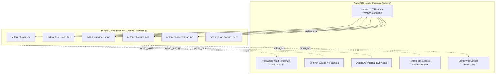

# Phát triển Plugin WebAssembly (WASM)

ActonOS thực thi toàn bộ plugin dưới dạng module WebAssembly (`wasip1` / `wasm32-wasi`) được đóng gói cách ly (sandboxed) bên trong **Wazero JIT runtime** (engine WebAssembly thuần Go 100%, không phụ thuộc CGO).

Phân hệ thống nhất **WASMLoader** (`internal/plugin/`) hợp nhất các **Công cụ Agent (Tools)**, **Kênh giao tiếp (Chat Channels)** (Telegram, Discord, Slack, WhatsApp, Zalo), và **Kết nối SaaS (Connectors)** (GitHub, Notion, Linear, Google Workspace) thành các gói `.wasm` an toàn và tệp nén phân phối `.actonpkg`.

---

## 1. Kiến trúc Hệ thống & Mô hình Thực thi

Mỗi plugin chạy trong một không gian bộ nhớ tuyến tính (Linear Memory) độc lập được quản lý bởi Wazero. Mọi tương tác với tài nguyên hệ điều hành (mạng, khóa bí mật Vault, bộ nhớ lưu trữ, bus sự kiện và luồng WebSocket) đều được điều hướng qua các lệnh gọi hệ thống (Host Syscalls) do cổng bảo mật ActonOS Security Gate kiểm soát.



---

## 2. Hợp đồng Host ABI Syscalls & Hàm Nhập (Imports)

Plugin giao tiếp với ActonOS Host thông qua các lệnh gọi hệ thống định kiểu thuộc không gian tên `acton_*`:

| Module Host | Hàm | Chữ ký (Signature) | Mô tả |
|:---|:---|:---|:---|
| `acton_sys` | `log` | `(level: int32, ptr: uint32, len: uint32)` | Ghi log có cấu trúc (`1=Debug`, `2=Info`, `3=Warn`, `4=Error`). |
| `acton_sys` | `read_response` | `(destPtr: uint32, destLen: uint32) -> int32` | Sao chép phản hồi đệm từ host vào bộ nhớ tuyến tính của WASM. |
| `acton_net` | `http_request` | `(reqPtr: uint32, reqLen: uint32) -> uint32` | Thực hiện yêu cầu HTTP cách ly (phải khớp whitelist `net_outbound`). |
| `acton_ws` | `ws_connect` | `(urlPtr, urlLen, hPtr, hLen: uint32) -> int32` | Mở kết nối WebSocket; trả về `handleID` (hoặc `-1` nếu lỗi). |
| `acton_ws` | `ws_send` | `(handleID: int32, msgType: int32, dataPtr, dataLen: uint32) -> int32` | Gửi dữ liệu qua WebSocket (`1=Text`, `2=Binary`). |
| `acton_ws` | `ws_poll` | `(handleID: int32) -> int32` | Thăm dò non-blocking nhận frame WebSocket (`>0=độ dài`, `0=trống`, `-1=đã đóng`). |
| `acton_ws` | `ws_close` | `(handleID: int32) -> int32` | Đóng và giải phóng kết nối WebSocket. |
| `acton_vault`| `get_secret` | `(keyPtr: uint32, keyLen: uint32) -> uint32` | Đọc khóa bí mật mã hóa phần cứng từ Vault (phải khớp `permissions.secrets`). |
| `acton_storage`| `kv_get` | `(keyPtr: uint32, keyLen: uint32) -> uint32` | Lấy giá trị từ phân vùng SQLite KV độc lập của plugin. |
| `acton_storage`| `kv_set` | `(kPtr, kLen, vPtr, vLen: uint32) -> int32` | Lưu cặp key-value vào phân vùng SQLite KV. |
| `acton_storage`| `kv_delete` | `(keyPtr: uint32, keyLen: uint32) -> int32` | Xóa key khỏi phân vùng lưu trữ SQLite. |
| `acton_bus` | `emit_event` | `(tPtr, tLen, pPtr, pLen: uint32) -> int32` | Phát sự kiện lên Event Bus hệ thống (phải khớp `permissions.bus_events`). |

---

## 3. Điểm vào Xuất khẩu WASM & Quản lý Bộ nhớ

Mỗi tệp nhị phân plugin biên dịch phải xuất khẩu các điểm vào chuẩn để host điều phối vòng đời:

```go
// Bộ cấp phát bộ nhớ tuyến tính
//go:wasmexport acton_alloc
func acton_alloc(size uint32) uint32

//go:wasmexport acton_free
func acton_free(ptr uint32, length uint32)

// Vòng đời & Xử lý sự kiện
//go:wasmexport acton_plugin_init
func acton_plugin_init() int32

//go:wasmexport acton_tool_execute
func acton_tool_execute(namePtr uint32, nameLen uint32, argsPtr uint32, argsLen uint32) uint64 // Trả về packed (ptr << 32 | len)

//go:wasmexport acton_channel_send
func acton_channel_send(ptr uint32, length uint32) int32

//go:wasmexport acton_channel_poll
func acton_channel_poll() uint64 // Trả về packed (ptr << 32 | len)

//go:wasmexport acton_connector_action
func acton_connector_action(ptr uint32, length uint32) uint64 // Trả về packed (ptr << 32 | len)
```

---

## 4. Các Mẫu Lập trình Cốt lõi với Plugin SDK

Nhà phát triển có thể viết plugin bằng Go (với `ActonOS-Plugin-SDK`), TinyGo, Rust hoặc bất kỳ ngôn ngữ nào hỗ trợ mục tiêu WASI.

### 4.1. Công cụ Agent Định kiểu (`sdk.Tool`)

Định nghĩa công cụ cho ReAct Agent Swarm tự động sinh JSON Schema:

```go
package main

import (
	"github.com/actonos/actonos-plugin-sdk/sdk"
)

type WeatherInput struct {
	City  string `json:"city" jsonschema:"title=City Name,description=Target city,required"`
	Units string `json:"units" jsonschema:"title=Units,enum=celsius|fahrenheit,default=celsius"`
}

func init() {
	tool := sdk.NewTypedTool("get_weather", "Lấy thông tin thời tiết hiện tại", func(ctx sdk.Context, in WeatherInput) (*sdk.ToolResult, error) {
		resp, err := ctx.HTTP().Get("https://api.weather.com/v1/" + in.City)
		if err != nil {
			return sdk.NewResultError(err.Error()), nil
		}
		return sdk.NewResultData("Success", map[string]any{"city": in.City, "data": string(resp.Body)}), nil
	})
	sdk.RegisterTool(tool)
}

func main() {}
```

### 4.2. Bộ Điều hợp Kênh Chat Đa Tài khoản & WebSocket (`sdk.ChannelAdapter`)

Kết nối ứng dụng chat bên ngoài với các Agent thông minh:

```go
type DiscordConfig struct {
	Accounts []DiscordAccount `json:"accounts"`
}

type DiscordAccount struct {
	AccountID    string `json:"account_id"`
	BotToken     string `json:"bot_token"`
	DefaultAgent string `json:"default_agent"`
}

type DiscordChannel struct {
	sdk.BaseChannel
}

func (c *DiscordChannel) SendMessage(ctx sdk.Context, msg sdk.OutboundMessage) error {
	token, _ := ctx.Vault().GetSecret("discord_bot_tokens." + msg.AccountID)
	if name, mime, data, ok := msg.AttachedFile(); ok {
		// Host đã chuyển tệp sẵn. Tải lên bằng API của nền tảng này.
		_ = name
		_ = mime
		_ = data
	}
	// Gửi tin nhắn chữ qua HTTP hoặc WebSocket...
	return nil
}

func (c *DiscordChannel) PollMessages(ctx sdk.Context) ([]sdk.InboundMessage, error) {
	var cfg DiscordConfig
	_ = ctx.Config().Bind(&cfg)
	
	// Nhận tin nhắn đến qua WebSocket (ctx.WS()) hoặc REST polling
	return inbounds, nil
}
```

### 4.3. Kết nối SaaS & Cầu nối Công cụ ReAct (`sdk.Connector`)

Tích hợp API SaaS và tự động chuyển các hành động thành Công cụ có thể gọi bởi Agent:

```go
func init() {
	conn := sdk.NewBaseConnector("github", "GitHub", "oauth2").
		WithSecretKey("github_access_token")

	sdk.RegisterTypedAction(conn, "list_repos", "Liệt kê kho lưu trữ", func(ctx sdk.Context, in ListInput) (any, error) {
		token, _ := conn.GetAuthToken(ctx)
		resp, err := ctx.HTTP().GetWithBearer("https://api.github.com/user/repos", token)
		return resp, err
	})

	sdk.RegisterConnector(conn)

	// Chuyển toàn bộ hành động SaaS thành Công cụ cho Agent!
	for _, tool := range conn.AsTools() {
		sdk.RegisterTool(tool)
	}
}
```

---

## 5. Chuẩn Khai báo Manifest (`manifest.json`)

Mỗi plugin PHẢI chứa tệp `manifest.json` tuân theo chuẩn `spec/MANIFEST_SCHEMA.json`:

```json
{
  "id": "channel-discord",
  "name": "Discord Bot Channel",
  "version": "2.0.0",
  "description": "Tích hợp Discord Bot cho AI Agents ActonOS",
  "author": "ActonOS Core Team",
  "license": "MIT",
  "capabilities": ["channel"],
  "permissions": {
    "net_outbound": ["discord.com", "gateway.discord.gg"],
    "secrets": ["discord_bot_tokens.*"],
    "storage": true,
    "bus_events": ["channel.discord.received", "channel.discord.sent"]
  },
  "config_schema": {
    "type": "object",
    "properties": {
      "poll_interval_seconds": {
        "type": "integer",
        "title": "Khoảng thời gian thăm dò (giây)",
        "default": 3,
        "x-ui-group": "Cài đặt Chung"
      },
      "accounts": {
        "type": "array",
        "title": "Tài khoản Discord Bot",
        "x-ui-group": "Danh sách Bot",
        "items": {
          "type": "object",
          "required": ["account_id", "bot_token", "default_agent"],
          "properties": {
            "account_id": {
              "type": "string",
              "title": "Mã Định Danh Tài Khoản",
              "x-ui-placeholder": "bot_support"
            },
            "bot_token": {
              "type": "string",
              "title": "Bot Token",
              "x-secret": true,
              "x-ui-widget": "password"
            },
            "default_agent": {
              "type": "string",
              "title": "Agent Mặc Định",
              "x-ui-widget": "agent-selector"
            }
          }
        }
      }
    }
  }
}
```

### Thuộc tính Mở rộng UI Schema

Giao diện ActonOS tự động sinh form cấu hình từ các thuộc tính bổ sung:

- `x-secret: true`: Báo hiệu giá trị nhạy cảm cần được mã hóa và bảo vệ trong **Hardware Vault** (`vault.db`).
- `x-ui-widget`: Gợi ý điều khiển form hiển thị (`"password"`, `"agent-selector"`, `"textarea"`, `"slider"`).
- `x-ui-group`: Nhóm các trường vào các khối mở rộng UI gập mở.
- `x-ui-placeholder`: Văn bản gợi ý trong ô nhập liệu.
- `x-order`: Thứ tự ưu tiên sắp xếp hiển thị trong biểu mẫu.

---

## 6. Bộ Công cụ Dòng lệnh CLI (`acton-plugin`)

Bộ công cụ `acton-plugin` hỗ trợ toàn diện chu trình phát triển:

```bash
# 1. Biên dịch plugin thành nhị phân WebAssembly (wasip1)
go run ./cmd/acton-plugin build -src ./plugins/channels/discord -out dist/channel-discord.wasm

# 2. Kiểm tra tính hợp lệ của manifest
go run ./cmd/acton-plugin validate -manifest ./plugins/channels/discord/manifest.json

# 3. Chạy thử nghiệm plugin trong môi trường MockHost sandbox
go run ./cmd/acton-plugin test -wasm dist/channel-discord.wasm

# 4. Đóng gói thành gói phân phối chính thức .actonpkg
go run ./cmd/acton-plugin pack -manifest ./plugins/channels/discord/manifest.json -wasm dist/channel-discord.wasm -out dist/channel-discord.actonpkg
```

---

## 7. Đóng gói & Phân phối `.actonpkg`

Tệp `.actonpkg` là một kho lưu trữ ZIP chứa:
1. `manifest.json`: Siêu dữ liệu, phân quyền và schema cấu hình giao diện.
2. `plugin.wasm`: Tệp nhị phân WebAssembly đã biên dịch cho mục tiêu WASI.
3. Tài nguyên tùy chọn (biểu tượng icon, tài liệu hướng dẫn).

### Tải lên ActonOS:
Người dùng có thể tải lên tệp `.actonpkg` hoặc tệp `.wasm` trực tiếp qua giao diện **Plugins** (`/plugins`) hoặc qua REST API:

```bash
curl -X POST http://localhost:8080/api/plugins/upload \
  -H "Authorization: Bearer <token>" \
  -F "file=@dist/channel-discord.actonpkg"
```

Hệ thống sẽ lập tức kiểm tra manifest, khởi tạo sandbox trong Wazero, liên kết các cầu nối tương ứng (`WasmToolBridge`, `WasmChannelBridge`, hoặc `WasmConnectorBridge`), và kích hoạt plugin mà không cần khởi động lại `actond`.

---

## 8. Host chuyển tệp cho plugin kênh {#sending-files}

Khi người dùng nhờ agent gửi `report.pdf` sang Telegram (hoặc kênh khác), **ActonOS không tự tải tệp lên**. Host đọc tài liệu từ User Workspace rồi chuyển nguyên byte sang hàm `acton_channel_send` của plugin.

Plugin của bạn phải tự nói chuyện với ứng dụng chat.

### Các trường trong envelope

`sdk.OutboundMessage` gồm:

| Trường | Ý nghĩa |
|:---|:---|
| `FileName` | Tên tải về gốc (`report.pdf`) |
| `MIMEType` | Kiểu nội dung (`application/pdf`) |
| `FileData` | Byte thô của tệp (trên dây được mã hóa JSON base64) |
| `Content` | Chú thích tùy chọn |
| `Kind` | `media` khi có đính kèm tệp |

Dùng `msg.AttachedFile()` để lấy bộ ba `(name, mime, data)`. Hàm hỗ trợ: `sdk.NewOutboundFile(...)`.

### Giữ nguyên tệp nhị phân

**Không** nhét byte PDF hay ảnh vào trường chuỗi JSON rồi `json.Marshal`. UTF-8 không hợp lệ bị thay bằng `U+FFFD`, người dùng tải về sẽ thấy **lỗi font**.

Với tải `multipart/form-data` kiểu Telegram:

```go
contentType, body, err := sdk.EncodeMultipart(fields, "document", name, data)
resp, err := ctx.HTTP().PostBinary(url, contentType, body)
```

`PostBinary` gửi `body_base64` tới syscall HTTP của host, giữ đúng từng byte. Đừng dùng `body` dạng chữ cho payload nhị phân.

### Làm theo API của từng ứng dụng

| Nền tảng | Cách tải lên thường dùng |
|:---|:---|
| **Telegram, Discord, Slack, WhatsApp** | Tải tệp multipart (`EncodeMultipart` + `PostBinary`) |
| **Zalo Bot API** | JSON qua HTTPS. Trường tệp là **URL HTTPS công khai** (hoặc `data:` URI nhỏ). Body multipart bị bỏ qua. HTTP 200 kèm `"ok": false` phải coi là **thất bại** — Zalo thường trả 200 dù gửi không thành công. |

Nếu plugin báo thành công nhưng người dùng không thấy tệp, hãy kiểm tra bạn đang gọi đúng API của nền tảng đó — không phải API Telegram — và ghi log khi gặp `ok: false`.
