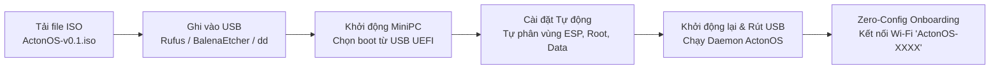

# Cài đặt trên MiniPC Bare-Metal

Cài đặt ActonOS trực tiếp lên phần cứng biến MiniPC x86_64 thành một máy chủ AI chuyên dụng với hệ thống tệp bất biến, cách ly namespace ở cấp nhân Linux (Bubblewrap + Cgroups v2) và cơ chế cập nhật OTA tự phục hồi.



---

## Bước 1: Tải file ISO ActonOS

Tải file ISO chính thức từ trang phát hành:
- **Tên file**: `ActonOS-v0.1-amd64.iso`

---

## Bước 2: Ghi file ISO vào USB

Chuẩn bị một chiếc USB có dung lượng tối thiểu **4 GB**.

### Cách 1: Sử dụng Rufus (Windows)
1. Cắm USB vào máy tính và mở **[Rufus](https://rufus.ie/)**.
2. Chọn USB tại mục **Device**.
3. Bấm **Select** và chọn file `ActonOS-v0.1-amd64.iso`.
4. Tại mục Partition scheme chọn **GPT**, Target system chọn **UEFI (non-CSM)**.
5. Bấm **START** và chọn **Write in DD Image mode** khi được hỏi.

### Cách 2: Sử dụng BalenaEtcher (macOS, Windows, Linux)
1. Mở **[BalenaEtcher](https://etcher.balena.io/)**.
2. Chọn **Flash from file** và duyệt đến file `ActonOS-v0.1-amd64.iso`.
3. Chọn USB của bạn và bấm **Flash!**.

### Cách 3: Sử dụng lệnh `dd` (Linux / macOS CLI)

```bash
# Xác định tên ổ USB (ví dụ /dev/sdb)
lsblk

# Ghi trực tiếp image vào USB
sudo dd if=ActonOS-v0.1-amd64.iso of=/dev/sdX bs=4M status=progress conv=fsync
```

---

## Bước 3: Khởi động MiniPC và Cài đặt

1. Cắm USB vừa tạo vào cổng USB 3.0 trên MiniPC.
2. Cắm dây mạng LAN (khuyến nghị) và bật nguồn thiết bị.
3. Nhấn liên tục phím chọn menu Boot khi máy vừa bật:
   - **Intel N100 / Beelink / Minisforum**: Thường là phím `F7` hoặc `F11` (hoặc `Del`/`Esc` vào BIOS).
   - **ASUS / ASRock**: `F8` hoặc `F11`.
   - **Lenovo / HP / Dell**: `F12`.
4. Chọn dòng **UEFI: USB Flash Drive**.
5. Trình cài đặt tự động (**Automated Headless Installer**) sẽ tự động thực hiện mọi thao tác.

:::important Tự động Phân vùng Ổ cứng
Trình cài đặt sẽ tự động thiết lập ổ cứng trong máy theo cấu trúc sau:
- **Phân vùng 1 (ESP)**: `512 MB` FAT32 UEFI Bootloader (`/boot/efi`).
- **Phân vùng 2 (System Root)**: `4 GB` Ext4 **Read-Only** (Hệ điều hành bất biến `/`).
- **Phân vùng 3 (User Data)**: Dung lượng còn lại Ext4 Read-Write (`/data`).
*Lưu ý: Mọi dữ liệu cũ trên ổ cứng trong máy sẽ được xóa sạch.*
:::

6. Quá trình cài đặt mất khoảng 90–120 giây.
7. Khi hoàn tất, MiniPC sẽ phát tiếng bíp (hoặc thông báo thành công), tự đẩy USB ra và khởi động lại vào ActonOS.

---

## Bước 4: Kiểm tra Sau khi Khởi động

- Nếu có cắm dây mạng LAN, ActonOS sẽ nhận IP tự động và phát mDNS tại `http://acton.local:8080`.
- Nếu không có mạng dây trong 60 giây, ActonOS sẽ tự động phát sóng Wi-Fi **`ActonOS-XXXX`** để bạn kết nối cài đặt.
