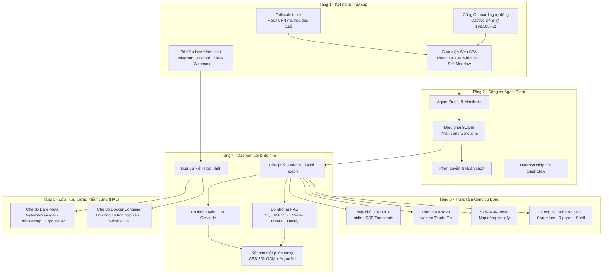

# ActonOS: Hệ điều hành AI Bản địa cho Tác nhân Tự trị

**ActonOS** là hệ điều hành và nền tảng điều phối tác nhân tự trị (Autonomous Agent Hub) thế hệ mới, được thiết kế chuyên biệt để vận hành các nhóm tác nhân AI (Multi-Agent Swarms) liên tục 24/7 trên phần cứng chuyên dụng hoặc trong môi trường container.

Không giống các framework bọc ngoài truyền thống, ActonOS đưa trực tiếp **Động cơ Agent**, **Môi trường cách ly Sandbox**, **Két bảo mật phần cứng Hardware Vault** và **Bộ nhớ ngữ nghĩa Hybrid RAG** vào tầng lõi của hệ điều hành.

---

## Các Trụ cột & Nguyên lý Thiết kế Cốt lõi

### 1. Lớp Trừu tượng Phần cứng Kép (Dual-Runtime HAL)
ActonOS tự động phát hiện môi trường thực thi khi khởi động:
- **Chế độ Bare-Metal MiniPC**: Bản cài đặt hệ điều hành bất biến trên phần cứng x86_64 (như Intel N100 / AMD Ryzen). Tích hợp Linux D-Bus, NetworkManager quản lý Wi-Fi Hotspot, Bubblewrap cách ly namespace và Cgroups v2 giới hạn tài nguyên.
- **Chế độ Docker Container**: Đóng gói container Linux tiêu chuẩn với đầy đủ bộ công cụ phát triển tích hợp sẵn (Python, Node.js, Chromium, Ripgrep, SQLite).

### 2. Khung Tác nhân Đa năng & Multi-Agent Swarm
Tạo không giới hạn các Agent với persona, chỉ thị hệ thống, mô hình LLM, quyền hạn công cụ và ngân sách đại biểu riêng biệt. Các Agent có thể hoạt động độc lập hoặc tạo thành **Swarm**, trong đó Agent điều phối sẽ phân rã mục tiêu lớn thành đồ thị phụ thuộc DAG và phân công cho các Agent con qua Goroutines.

### 3. Nạp nóng Công cụ Động (Hot-Swappable Tools)
Hỗ trợ 3 giao thức mở rộng linh hoạt mà không cần khởi động lại daemon:
- **Model Context Protocol (MCP)**: Máy khách MCP native hỗ trợ giao thức stdio và HTTP/SSE JSON-RPC.
- **WebAssembly thuần Go (WASM)**: Thực thi plugin siêu tốc, an toàn qua runtime `wazero`.
- **Skill-as-a-Folder**: Tạo thư mục chứa file `skill.json` và script Bash/Python, tự động nạp nóng qua `fsnotify`.

### 4. Bộ nhớ Ngữ nghĩa Lai (Hybrid RAG)
- **Tìm kiếm từ khóa**: SQLite FTS5 với thuật toán xếp hạng BM25.
- **Tìm kiếm Vector**: Kho vector `chromem-go` kết hợp daemon `embeddingd` cục bộ chạy mô hình ONNX `multilingual-e5-small`.
- **Suy giảm Nhận thức Ebbinghaus**: Áp dụng đường cong quên lãng để cân bằng giữa ngữ cảnh gần đây và tri thức dài hạn.

### 5. Bảo mật Ràng buộc Phần cứng & Hệ thống Bất biến
- **Két mã hóa AES-256-GCM**: Khóa mã hóa được sinh từ định danh phần cứng (DMI UUID + CPU Serial) kết hợp Argon2id.
- **Cách ly Sandbox**: Giới hạn nghiêm ngặt tài nguyên (512 MB RAM, 50% CPU, 30 PIDs) và namespace hệ thống tệp.
- **Sổ cái Kiểm toán Bất biến**: Toàn bộ thao tác và token tiêu thụ được nối vào chuỗi băm SHA-256 (`audit.jsonl`).

### 6. Kết nối Tiện lợi Không cần Mở cổng Modem
- **Captive Portal**: Khi khởi động lần đầu, MiniPC phát Wi-Fi `ActonOS-XXXX` mở trang cài đặt tự động tại `192.168.4.1`.
- **Tailscale `tsnet` Tích hợp Sẵn**: Truy cập từ xa an toàn qua mạng Mesh VPN mã hóa đầu-cuối mà không cần mở port modem.
