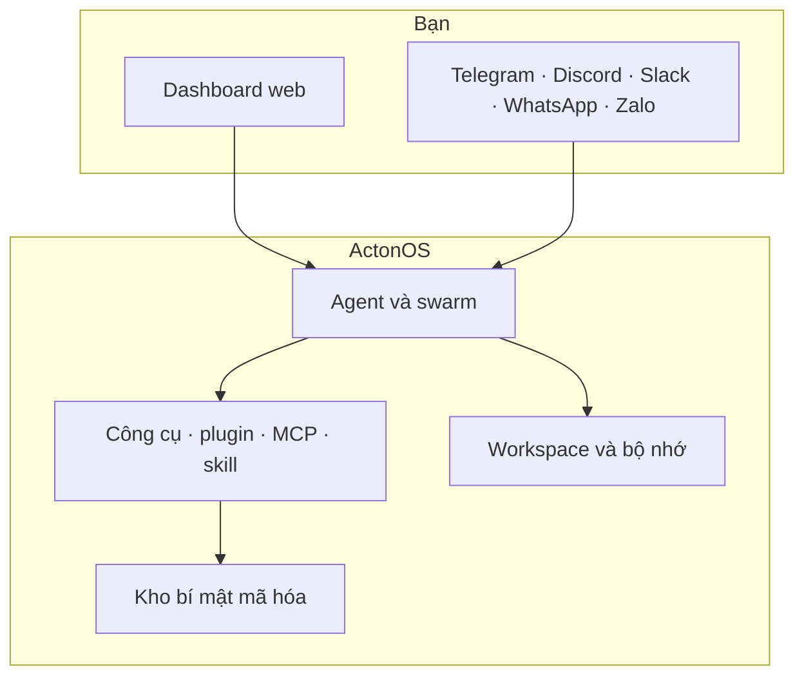

# ActonOS là gì?

**ActonOS** là hệ điều hành dành cho agent AI: chạy trên MiniPC, máy chủ nhà, hoặc Docker. Bạn chat với agent, giao công cụ và tệp, kết nối Telegram hay GitHub, rồi để chúng làm việc nền — có phê duyệt, sandbox, và kho bí mật mã hóa sẵn trong hệ thống.

Bộ tài liệu này dành cho người **dùng** ActonOS: cài đặt, tạo agent, nối app chat, và (nếu muốn) viết plugin. Phần sâu về nội bộ nằm ở [Kiến trúc nâng cao](../advanced-architecture/dual-runtime-hal).

---

## Bạn có thể làm gì

| Bạn muốn… | Bắt đầu từ đây |
|:---|:---|
| Cài đặt và mở dashboard | [Yêu cầu hệ thống](system-requirements) → [Docker](docker-deployment) hoặc [Bare-metal](baremetal-installation) |
| Tạo agent và chạy việc đầu tiên | [Hướng dẫn 5 phút](quickstart-tutorial) |
| Chat, đính tệp, lưu công việc | [Chat](../user-guide/ai-chat) và [Workspace](../user-guide/workspace) |
| Nối Telegram, Discord, Slack, WhatsApp hoặc Zalo | [Kênh chat](../user-guide/channels) |
| Nối GitHub, Notion, Google Workspace… | [Connectors](../user-guide/connectors) |
| Cài hoặc tự viết plugin | [Plugins](../user-guide/plugins) và [Plugin SDK](../plugin-sdk/overview) |

---

## Một ngày làm việc điển hình

1. Mở dashboard, xem agent, CPU và đĩa còn ổn không.
2. Chat với agent, đính PDF, hoặc nhờ ghi tệp vào **Workspace**.
3. Mở **Nhiệm vụ** khi công việc cần nhiều bước và checkpoint.
4. Để **Tự động hóa** (heartbeat / cron) chạy việc lặp trong giờ làm.
5. Nhận **Thông báo** khi có thứ cần bạn phê duyệt.

Bạn không cần biết Go, WebAssembly hay nội bộ daemon.

---

## ActonOS được ghép như thế nào

ActonOS là một daemon (`actond`) cộng giao diện web. Agent suy luận, gọi công cụ, nhớ tệp. Plugin, máy chủ MCP và skill thêm năng lực mà không cần khởi động lại OS.

Cam kết quan trọng, nói giản dị:

- **Hai cách cài**: ảnh MiniPC chuyên dụng, hoặc Docker trên máy bạn đã có. ActonOS tự nhận ra.
- **Agent nằm trong sandbox**: công cụ không được tùy ý sửa hệ điều hành. Việc rủi ro dừng lại chờ bạn.
- **Bí mật được mã hóa**: token bot và API key vào vault gắn phần cứng, không phải file plaintext.
- **Plugin bị giới hạn**: chỉ gọi được website và bí mật mà manifest cho phép.

Chi tiết kỹ thuật: [Dual-Runtime HAL](../advanced-architecture/dual-runtime-hal) và [Hardware Vault](../advanced-architecture/hardware-vault-security).

---

## Chọn cách cài

- **Thử nhanh** trên laptop hoặc máy chủ sẵn có: [Triển khai Docker](docker-deployment).
- **Chạy như appliance** trên MiniPC: [Cài bare-metal](baremetal-installation) và [Onboarding zero-config](zero-config-onboarding).

Sau đó làm [hướng dẫn 5 phút](quickstart-tutorial) để tạo agent đầu tiên.
