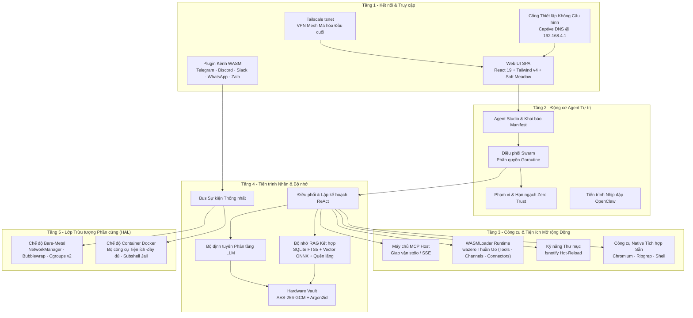

# ActonOS: Hệ điều hành Tự trị Bản địa AI

**ActonOS** là hệ điều hành và động cơ điều phối được thiết kế chuyên biệt để vận hành các Agent AI tự trị và mạng lưới Multi-Agent Swarm liên tục 24/7 trên phần cứng chuyên dụng hoặc môi trường container.

Khác với các hệ điều hành truyền thống được gắn thêm lớp giao diện AI bên ngoài, ActonOS đặt **Động cơ Agent**, **Môi trường Sandbox Plugin WASMLoader**, **Két Bảo mật Phần cứng**, và **Hệ thống Bộ nhớ Ngữ nghĩa Kết hợp** trực tiếp vào phân tầng nhân hệ thống.

---

## Các Trụ cột & Nguyên lý Thiết kế Cốt lõi

### 1. Lớp Trừu tượng Phần cứng Chế độ Kép (Dual-Runtime HAL)
ActonOS tự động nhận diện môi trường phần cứng khi khởi động:
- **Chế độ Bare-Metal MiniPC**: Bản cài hệ điều hành bất biến trên phần cứng x86_64 chuyên dụng (như Intel N100 / AMD Ryzen). Tích hợp Linux D-Bus, NetworkManager cho điểm phát sóng Wi-Fi, Bubblewrap cho cách ly namespace và Cgroups v2 để quản trị tài nguyên.
- **Chế độ Container Docker**: Gói container Linux tiêu chuẩn đi kèm toàn bộ bộ công cụ lập trình sẵn có (Python, Node.js, Chromium, Ripgrep, SQLite).

### 2. Khung làm việc Agent Vạn năng & Swarm Đa Agent
Tạo không giới hạn số lượng Agent AI với tính cách, chỉ thị hệ thống, mô hình LLM phân tầng, phạm vi công cụ và ngân sách ủy quyền riêng biệt. Các Agent có thể vận hành độc lập hoặc tạo thành **Mạng lưới Swarm**, trong đó Agent chỉ huy phân rã mục tiêu lớn thành đồ thị DAG và ủy quyền tác vụ con qua Goroutine song song.

### 3. Động cơ Mở rộng WASMLoader Động
ActonOS cung cấp mô hình mở rộng an toàn thực thi trên engine **Wazero JIT runtime** thuần Go 100%:
- **Plugin WASM (`.actonpkg`)**: Đóng gói WebAssembly cho Công cụ, Kênh chat và Kết nối SaaS với biểu mẫu cấu hình động và bảo mật qua Hardware Vault.
- **Giao thức Ngữ cảnh Mô hình (MCP)**: Máy chủ máy khách native stdio và HTTP/SSE JSON-RPC cho các server công cụ bên ngoài.
- **Kỹ năng Thư mục (Skill-as-a-Folder)**: Các script tự động hot-reload chứa `skill.json` và mã nguồn Bash/Python được giám sát qua `fsnotify`.

### 4. Bộ nhớ Ngữ nghĩa Kết hợp (Hybrid Memory RAG)
Ngữ cảnh dài hạn và tệp trong workspace được lập chỉ mục kết hợp:
- **Tìm kiếm Từ khóa**: SQLite FTS5 với xếp hạng BM25 để truy xuất chính xác cụm từ.
- **Tìm kiếm Vector**: Kho vector `chromem-go` kết hợp tiến trình nội bộ `embeddingd` chạy mô hình ONNX `multilingual-e5-small`.
- **Suy giảm Trí nhớ Ebbinghaus**: Mô hình toán học suy giảm ký ức cũ, ưu tiên thông tin thường xuyên sử dụng.

### 5. Bảo mật Gắn liền Phần cứng & Hệ thống Tệp Bất biến
- **Hardware Vault AES-256-GCM**: Thông tin xác thực và token OAuth được mã hóa bằng khóa dẫn xuất từ định danh phần cứng (DMI UUID + CPU serial) qua Argon2id.
- **Thực thi Cách ly (Sandbox)**: Công cụ của Agent chạy trong hạn ngạch tài nguyên nghiêm ngặt (RAM 512 MB, CPU 50%, 30 PIDs).
- **Sổ cái Kiểm toán Mật mã**: Mọi lệnh thực thi công cụ và sự kiện bảo mật đều được ghi nối tiếp vào chuỗi băm SHA-256 bất biến (`audit.jsonl`).

### 6. Kết nối Không cần Cấu hình (Zero-Config)
- **Cổng Captive Portal**: Khi khởi động lần đầu trên MiniPC, hệ thống tự động phát Wi-Fi `ActonOS-XXXX` mở trang hướng dẫn thiết lập chỉ trong 1 phút.
- **Nhúng Tailscale `tsnet`**: Truy cập từ xa an toàn qua mạng riêng ảo WireGuard mesh mã hóa đầu cuối mà không cần mở port modem hay cấu hình Dynamic DNS.

---

## Các Bước Tiếp theo

- Xem [Yêu cầu Hệ thống](system-requirements) để chuẩn bị phần cứng hoặc máy chủ.
- Triển khai bằng [Docker](docker-deployment) để trải nghiệm nhanh trên hạ tầng có sẵn.
- Cài đặt trên [MiniPC Bare-metal](baremetal-installation) để có trải nghiệm thiết bị chuyên dụng hoàn chỉnh.
