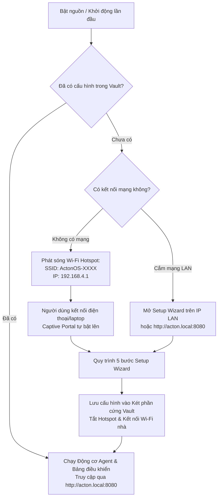

# Cài đặt Lần đầu (Setup Wizard)

Khi khởi động ActonOS lần đầu tiên trên MiniPC hoặc trong môi trường Docker mới, trình hướng dẫn **Zero-Config Setup Wizard** sẽ giúp bạn cấu hình mạng, API key AI và bảo mật chỉ trong vài bước.



---

## Cách Truy cập Setup Wizard

### Cách 1: Qua Wi-Fi Hotspot (Captive Portal)
1. Mở cài đặt Wi-Fi trên điện thoại, máy tính bảng hoặc laptop.
2. Tìm mạng Wi-Fi tên **`ActonOS-XXXX`** (trong đó `XXXX` là 4 ký tự cuối địa chỉ MAC của máy).
3. Kết nối vào mạng (không cần mật khẩu).
4. Màn hình **Captive Portal** sẽ tự động mở lên. Nếu không tự mở, hãy truy cập:
   ```
   http://192.168.4.1
   ```

### Cách 2: Qua Mạng LAN Cục bộ (Ethernet)
Nếu MiniPC hoặc Docker kết nối vào router qua mạng dây:
1. Mở trình duyệt trên máy tính cùng mạng LAN.
2. Truy cập địa chỉ:
   ```
   http://acton.local:8080
   ```

---

## 5 Bước trong Quy trình Cài đặt (Setup Wizard)

### Bước 1: Kết nối Wi-Fi (Chỉ Bare-Metal)
- ActonOS quét và hiển thị các mạng Wi-Fi 2.4 GHz và 5 GHz xung quanh.
- Chọn tên mạng Wi-Fi của bạn và nhập mật khẩu, sau đó bấm **Kiểm tra & Kết nối**.

### Bước 2: Nhập API Key Mô hình AI (LLM Providers)
Nhập API key cho các nhà cung cấp mô hình bạn muốn dùng:
- **OpenAI**: `sk-proj-...` (GPT-4o, GPT-4o-mini, o1, o3-mini)
- **Anthropic Claude**: `sk-ant-...` (Claude 3.5 Sonnet, Claude 3.7 Sonnet)
- **Google Gemini**: `AIzaSy...` (Gemini 2.0 Flash, Gemini 1.5 Pro)
- **Ollama / Local LLM**: Địa chỉ máy chủ (ví dụ `http://192.168.1.100:11434`)
- **Groq / DeepSeek**: (Tùy chọn mô hình tốc độ cao)

:::tip Két Bảo mật Phần cứng Vault
Mọi API key được mã hóa ngay lập tức trong Két an toàn (`vault.db`) bằng thuật toán **AES-256-GCM** kết hợp Argon2id dựa trên số serial chip CPU và UUID phần cứng của máy. Key không bao giờ được lưu dưới dạng văn bản thô trên ổ cứng.
:::

### Bước 3: Kết nối 1-Click Dịch vụ SaaS (OAuth 2.1)
- **Google Workspace**: 1-click kết nối Gmail, Google Drive, Docs và Calendar.
- **GitHub**: Cấp quyền quản lý repo, issues và pull requests.
- **Notion & Slack**: Kết nối không gian làm việc và kênh chat.

### Bước 4: Thiết lập Mã PIN Quản trị (Admin PIN)
Thiết lập mã PIN từ **4 đến 8 chữ số** để bảo vệ bảng điều khiển, mở khóa phiên làm việc và phê duyệt các hành động nhạy cảm của Agent.

### Bước 5: Truy cập Từ xa qua Tailscale (Tùy chọn)
Nhập mã [Tailscale Auth Key](https://login.tailscale.com/admin/settings/keys) (`tskey-auth-...`) để truy cập từ xa mọi lúc mọi nơi qua mạng Mesh VPN mà không cần mở cổng modem.

---

## Hoàn tất Cài đặt

Bấm **Hoàn tất & Khởi chạy ActonOS**. 
Hệ thống sẽ lưu cấu hình vào Két mã hóa, tắt Wi-Fi hotspot, kết nối vào mạng nhà của bạn và chuyển hướng thẳng đến **Bảng điều khiển ActonOS**.
