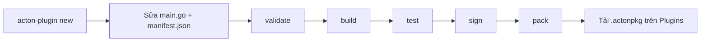

# Tổng quan Plugin SDK

**ActonOS Plugin SDK** (`github.com/actonos/plugin-sdk`, CLI `acton-plugin` **v1.3.0**) là cách bạn tự viết tiện ích. Viết Go, biên dịch WebAssembly, đóng gói `.actonpkg`, tải lên trang [Plugins](../user-guide/plugins). ActonOS chạy plugin trong sandbox. Không cần khởi động lại daemon.

Mục này là **hướng dẫn + how-to + tra cứu** cho người viết plugin. Nếu chỉ cài gói chính thức, ở lại [Plugins](../user-guide/plugins).

---

## Ba loại plugin

| Loại | Cờ `--type` | Việc nó làm | Ví dụ |
|:---|:---|:---|:---|
| **Tool** | `tool` | Một hoặc nhiều hàm agent gọi được, schema JSON tự sinh. | Đổi tiền, tạo ảnh |
| **Channel** | `channel` | Adapter chat: nhận tin, gửi text, typing, reaction, tệp. | Telegram, Discord, Zalo |
| **Connector** | `connector` | Tích hợp SaaS với action đặt tên, token vault, có thể bắc cầu thành tool. | GitHub, Notion, Linear |

Một gói có thể khai báo nhiều capability trong `manifest.json`, nhưng CLI scaffold **một** loại mỗi lần.

---

## Vòng đời



1. **Tạo khung** bằng `acton-plugin new`.
2. **Viết** handler với `sdk.Context` (HTTP, vault, storage, log).
3. **Khai báo** quyền trong `manifest.json` — chỉ host và bí mật thật sự cần.
4. **Build** ra `dist/plugin.wasm` (`GOOS=wasip1 GOARCH=wasm`).
5. **Test** trong mock host Wazero kèm CLI (không cần ActonOS đang chạy).
6. **Ký** Ed25519 và **đóng gói** `.actonpkg`.
7. **Tải lên** **Extensions → Plugins**.

---

## Sandbox cho phép gì

Plugin không mở tùy ý file trên host. Mọi thứ đi qua API host:

| Bạn gọi | Host làm |
|:---|:---|
| `ctx.HTTP()` / `ctx.WS()` | Mạng ra ngoài, lọc theo `permissions.net_outbound` |
| `ctx.Vault()` | Bí mật liệt kê trong `permissions.secrets` |
| `ctx.Storage()` | Kho key-value riêng theo id plugin |
| `ctx.Workspace()` | Đọc/ghi tệp Workspace **của user** (nếu được phép) |
| `ctx.Config()` | Settings user điền trên form |
| `ctx.Log()` | Dòng trên tab **Logs** |
| `ctx.EventBus()` | Sự kiện trong `permissions.bus_events` |

`"net_outbound": ["*"]` validate được nhưng kèm cảnh báo. Plugin production nên liệt kê hostname thật.

---

## Điều kiện trước {#prerequisites}

- **Go 1.26+** (target `wasip1` / `wasm` native). TinyGo tùy chọn (`--tinygo`).
- CLI `acton-plugin`, build từ repo SDK.

```bash
git clone https://github.com/actonos/plugin-sdk.git
cd plugin-sdk
go build -o acton-plugin ./cmd/acton-plugin/
```

Trên Windows binary là `acton-plugin.exe`. Đặt vào `PATH`.

---

## Đi tiếp

| Mục tiêu | Trang |
|:---|:---|
| Làm tool đầu tiên trong vài phút | [Plugin đầu tiên](first-plugin) |
| Tool chi tiết | [Plugin công cụ](tools) |
| Adapter chat, tệp, typing, reaction | [Plugin kênh](channels) |
| Action SaaS OAuth / API key | [Plugin connector](connectors) |
| `manifest.json`, quyền, schema UI | [Manifest và quyền](manifest) |
| Mọi cờ CLI | [Tra cứu CLI](cli-reference) |
| Ít quyền nhất và ký | [Bảo mật](security) |
| Catalog kênh và connector chính thức | [Plugin chính thức](official-plugins) |
| Import/export WASM cấp thấp | [Host ABI](host-abi) |
