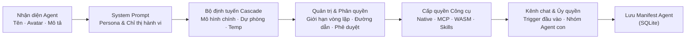

# Agent Studio & Cấu hình Swarm

**Agent Studio** là không gian làm việc trực quan giúp tạo, cấu hình và quản trị các tác nhân AI và nhóm tác nhân tự trị (Multi-Agent Swarms) trong ActonOS.



---

## 1. Nhận diện Agent & Persona

- **Tên & Định danh (Slug)**: Tên định danh duy nhất (ví dụ: `devops-architect`, `data-analyst`).
- **Avatar & Biểu tượng**: Hình ảnh hiển thị trong Chat, Kênh thông báo và Bảng điều khiển.
- **Mô tả**: Tóm tắt vai trò để con người và các Agent khác hiểu nhiệm vụ của nó.

---

## 2. Thiết kế System Prompt Chuẩn mực

System prompt định hình phong cách suy luận và quy tắc làm việc của Agent:

```markdown
# Vai trò & Mục tiêu
Bạn là chuyên gia DevOps chịu trách nhiệm giám sát dịch vụ ActonOS, phân tích sức khỏe container và tạo script triển khai.

# Quy tắc Vận hành
1. Luôn kiểm tra lệnh ở chế độ dry-run trước khi áp dụng cấu hình.
2. Giữ script tạm trong thư mục tạm riêng. Xuất tài liệu hoàn chỉnh vào Workspace của người dùng với tên gốc (ví dụ `diagnostics.md`).
3. Nếu thao tác cần khởi động lại dịch vụ hệ thống, hãy yêu cầu phê duyệt từ người dùng.
```

---

## 3. Bộ định tuyến Mô hình (LLM Cascade Router)

ActonOS tích hợp bộ định tuyến mô hình thông minh nhằm tối ưu độ tin cậy và chi phí:

| Thiết lập | Mô tả | Ví dụ |
|:---|:---|:---|
| **Mô hình Chính** | Mô hình được ưu tiên gọi đầu tiên | `anthropic:claude-3-7-sonnet` |
| **Mô hình Dự phòng 1** | Tự động chuyển sang khi mô hình chính chạm rate limit hoặc lỗi | `openai:gpt-4o` |
| **Mô hình Dự phòng 2** | Mô hình chi phí thấp hoặc chạy cục bộ | `google:gemini-2.0-flash` hoặc `ollama:qwen2.5-coder` |
| **Temperature** | Độ biến thiên sáng tạo (0.0 = chính xác, 1.0 = ngẫu hứng) | `0.2` (dùng cho lập trình/phân tích) |

---

## 4. Phân quyền Công cụ & Giới hạn Ngân sách

- **Phân quyền Công cụ**: Chọn từng công cụ hoặc dùng cú pháp wildcard:
  - `*` - Cho phép toàn bộ công cụ.
  - `native_*` - Chỉ cho phép các công cụ lõi hệ thống.
  - `mcp_github_*` - Chỉ cho phép các công cụ thuộc MCP GitHub.
- **Mức phê duyệt**:
  - `Low`: Chạy các công cụ đã cấp quyền mà không hỏi.
  - `Medium`: Được ghi Workspace; lệnh shell, xóa, cron và thay đổi tiện ích vẫn cần duyệt.
  - `High`: Xác nhận mọi thao tác nhạy cảm trước khi chạy.
- **Giới hạn Vòng lặp (Iteration Budget)**: Số bước suy luận tối đa cho một tác vụ (mặc định: `25`).

---

## 5. Cơ chế Ủy quyền Đa tác nhân (Swarm Delegation)

Kích hoạt tính năng **Ủy quyền Tác nhân (Agent Delegation)** cho phép một Agent cha phân rã công việc và giao cho các Agent con chuyên môn hóa chạy song song qua các Goroutine độc lập.
