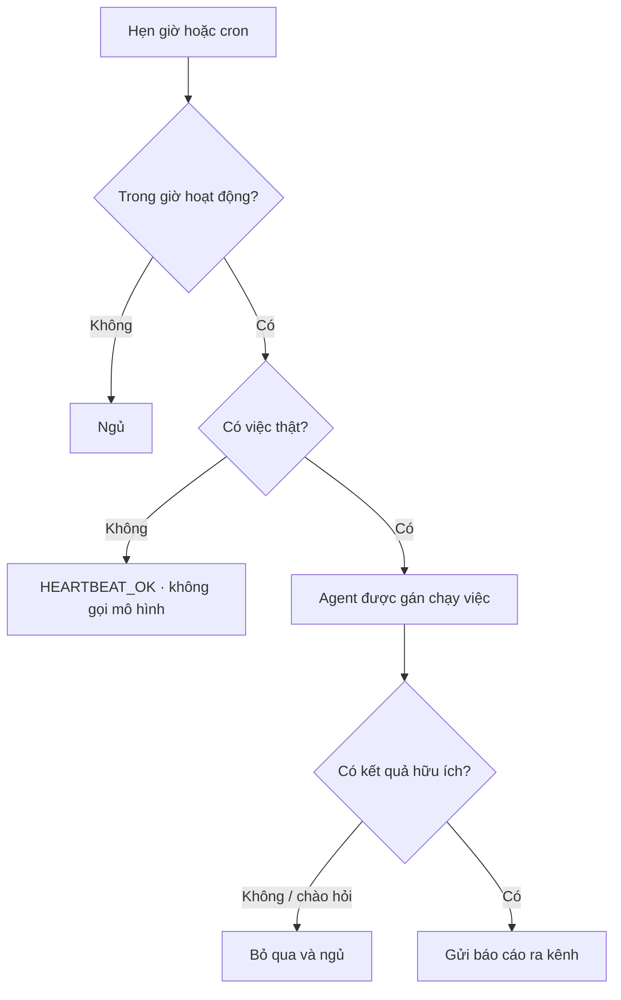

# Tự động hóa

**Automations** chạy việc định kỳ. Giữa các việc đó, **heartbeat** kiểm tra xem có thật sự cần gọi agent không — thời gian rỗi không tốn token.

---

## Tạo lịch

1. Mở **Automations** trên thanh bên.
2. Bấm **+ New Automation**.
3. Nhập cron 5 trường (ví dụ `0 9 * * 1-5` = 09:00 các ngày trong tuần).
4. Chọn agent và viết chỉ thị thường trực, ví dụ:

   ```
   Kiểm tra pull request GitHub đang mở, tóm tắt review, đăng lên Slack.
   ```

5. Có thể chọn kênh chat để nhận báo cáo.
6. Bấm **Save Automation**.

Bấm **Pulse Now** trên dashboard bất cứ lúc nào bạn muốn kiểm tra ngay.

---

## Heartbeat tiết kiệm token thế nào



Thực tế:

- **Rỗi thì miễn phí.** Hàng đợi trống và `HEARTBEAT.md` không có chỉ thị thì ActonOS **không** gọi mô hình.
- **Không tán gẫu.** Chạy headless sẽ lọc câu chào kiểu “Mình có thể giúp gì?”.
- **Giờ hoạt động.** Đặt khung (ví dụ `08:00`–`22:00` múi `Asia/Ho_Chi_Minh`) để ban đêm yên.
- **Cooldown.** Kích hoạt trong 15 giây được gom thành một nhịp.

Thiết kế theo [hợp đồng OpenClaw Heartbeat](https://docs.openclaw.ai/vi/gateway/heartbeat).

---

## Trang liên quan

- [Dashboard](dashboard) — **Pulse Now** và trạng thái agent.
- [Nhiệm vụ](missions) — việc dài một lần, không phải cron.
- [Kênh chat](channels) — nơi đăng báo cáo.
