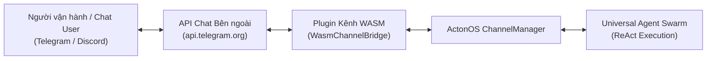

# Kênh Giao tiếp & Tin nhắn Đa kênh

ActonOS kết nối AI Agent với các nền tảng chat phổ biến (Telegram, Discord, Slack, WhatsApp, Zalo) thông qua **Plugin Kênh WASM** (`WasmChannelBridge`). Kiến trúc này tách biệt việc triển khai giao thức nhắn tin khỏi nhân hệ điều hành, đồng thời áp dụng cơ chế sandbox nghiêm ngặt, mã hóa token bằng Hardware Vault và xác thực ghép đôi Zero-Trust.

---

## 1. Cơ chế Hoạt động của Plugin Kênh

Thay vì viết cứng giao thức trong mã nguồn Go của daemon, các kênh chat chạy dưới dạng module WebAssembly biệt lập trong Wazero runtime:

### Các Khả năng Cốt lõi:
- **Ghép đôi Mã PIN Zero-Trust**: Ngăn chặn người lạ nhắn tin với bot bằng quy trình bắt tay mã PIN 6 chữ số trước khi cấp quyền điều khiển Agent.
- **Đa Tài khoản Bot (Multi-Bot)**: Kết nối nhiều bot trên cùng một nền tảng (ví dụ: `@dev_support_bot` và `@ops_monitor_bot`).
- **Định tuyến Tin nhắn Linh hoạt**: Định tuyến tin nhắn nhóm qua cú pháp nhắc tên `@agent_name` hoặc chuyển tiếp về Agent chính.
- **Truyền phát Luồng WebSocket Thời gian thực (`acton_ws`)**: Độ trễ cực thấp cho Discord Gateway và Slack Socket Mode.

---

## 2. Thiết lập Plugin Kênh Chat

### Bước 1: Cài đặt Plugin Kênh
1. Mở menu **Extensions** → chọn **Plugins** trên thanh điều hướng.
2. Nếu chưa cài đặt, tải lên gói plugin tương ứng (ví dụ: `channel-telegram.actonpkg` hoặc `channel-discord.actonpkg`).

### Bước 2: Cấu hình Tài khoản Bot & Token
1. Trên thẻ plugin, bấm **Configure** (Cấu hình).
2. Tại mục **Tài khoản Bot (Bot Accounts)**, bấm **+ Thêm tài khoản**.
3. Điền các tham số:
   - **Account ID**: Mã định danh duy nhất (ví dụ: `tg_dev_bot`).
   - **Bot Token**: Lấy từ [@BotFather](https://t.me/botfather) hoặc Discord Developer Portal.
   - **Agent Mặc định**: Chọn Agent phụ trách phản hồi tin nhắn từ bot này.
   - **Chế độ Định tuyến (Routing Mode)**:
     - `exclusive`: Chỉ các Agent được chỉ định mới nhận tin nhắn.
     - `mention`: Tin nhắn trong nhóm được chuyển cho Agent có tên `@agent_name`.
     - `fallback`: Chuyển tin nhắn chưa gắn nhãn về Agent mặc định.
4. Bấm **Lưu Thay đổi**. Token được mã hóa an toàn vào **Hardware Vault** (`vault.db`) và plugin hot-reload tức thì.

---

## 3. Bảo mật Người vận hành & Bắt tay Mã PIN Ghép đôi

Khi người dùng mới gửi tin nhắn cho bot lần đầu tiên, hệ thống sẽ thực hiện bắt tay xác thực:

1. Bot sẽ phản hồi lại một **mã ghép đôi 6 chữ số** dùng một lần (ví dụ: `842-195`).
2. Quản trị viên truy cập vào **System** → **Settings** (hoặc mở modal Ghép đôi) trên giao diện Web UI của ActonOS.
3. Nhập mã PIN 6 chữ số để phê duyệt User ID đó.
4. Sau khi xác thực thành công, danh tính người gửi được lưu trữ vĩnh viễn trong sổ cái ủy quyền và các tin nhắn tiếp theo sẽ được xử lý tự động bởi Agent swarm.

---

## 4. Giám sát Sức khỏe Kênh & Tự phục hồi

ActonOS liên tục kiểm tra trạng thái hoạt động của các bộ điều hợp kênh:
- **Bộ giám sát Polling & WebSocket Watchdog**: Khi vòng lặp bị gián đoạn hoặc mất socket, daemon tự động thực hiện tái kết nối theo thuật toán exponential backoff.
- **Huy hiệu Trạng thái**: Bảng điều khiển Plugins và Operations hiển thị trạng thái trực tiếp: 🟢 `Connected`, 🟡 `Reconnecting`, hoặc 🔴 `Error`.
- **Cảnh báo Tự động**: Nếu token bị thu hồi hoặc bị chặn API, ActonOS sẽ gửi thông báo khẩn cấp đến Trung tâm Thông báo kèm log chẩn đoán chi tiết.
