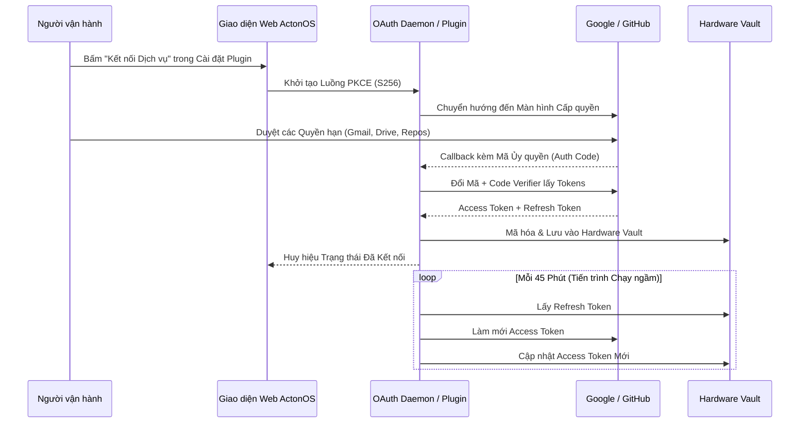

# Kết nối SaaS & OAuth 2.1

Khung làm việc **Kết nối SaaS (Connectors)** cho phép các AI Agent của ActonOS truy cập an toàn vào các bộ công cụ làm việc đám mây thông qua **Plugin Kết nối WASM** (`WasmConnectorBridge`) sử dụng tiêu chuẩn **OAuth 2.1 PKCE (S256)** mà không cần lưu trữ mật khẩu tĩnh dạng văn bản thô.

---

## 1. Các Plugin Kết nối SaaS Được Hỗ trợ

Mỗi plugin kết nối định nghĩa các hành động định kiểu và tự động chuyển đổi thành Công cụ ReAct Agent (`conn.AsTools()`):

| Plugin Dịch vụ | Khả năng Hỗ trợ | Công cụ Chuyển giao |
|:---|:---|:---|
| **Google Workspace** | Đọc/tìm Gmail, tạo sự kiện lịch, đọc/ghi tệp Google Drive. | `google_mail_search`, `google_calendar_create`, `google_drive_read` |
| **GitHub** | Tìm kiếm mã, liệt kê/tạo issues, mở pull request, xem commit. | `github_list_repos`, `github_create_issue`, `github_open_pr` |
| **Notion** | Truy vấn cơ sở dữ liệu, tạo trang mới, cập nhật bảng task. | `notion_query_database`, `notion_create_page` |
| **Slack** | Đọc lịch sử kênh, đăng thẻ tin nhắn đa phương tiện, tải tệp lên. | `slack_post_message`, `slack_read_history` |
| **Linear** | Quản lý vấn đề, tìm kiếm dự án, cập nhật chu kỳ sprint. | `linear_search_issues`, `linear_create_issue` |

---

## 2. Thiết lập Plugin Kết nối SaaS

1. Điều hướng đến **Extensions** → chọn **Plugins** trên thanh điều hướng.
2. Tìm plugin SaaS mong muốn (ví dụ: **GitHub Connector**) và bấm **Configure** (Cấu hình).
3. Nhập `Client ID` và `Client Secret` OAuth 2.1 (được bảo vệ trong Hardware Vault).
4. Bấm **Kết nối Tài khoản**. Cửa sổ xác thực sẽ xuất hiện để bạn đăng nhập và phê duyệt các quyền truy cập.
5. Sau khi cấp quyền, ActonOS nhận mã token và mã hóa lưu vào `/data/config/vault.db`.
6. Trạng thái chuyển sang 🟢 **Connected**, và các công cụ liên quan sẽ sẵn sàng cho các Agent sử dụng ngay.

---

## 3. Tiến trình Tự động Làm mới Token Ngầm

- ActonOS duy trì tiến trình nền kiểm tra thời hạn của toàn bộ token mỗi 5 phút một lần.
- Các access token sắp hết hạn được tự động làm mới ngầm trước thời điểm hết hiệu lực.
- Nếu việc làm mới thất bại (ví dụ do người dùng thu hồi quyền trên tài khoản Google/GitHub), hệ thống sẽ chuyển trạng thái sang 🔴 **Yêu cầu Xác thực lại** và gửi thông báo cảnh báo.
