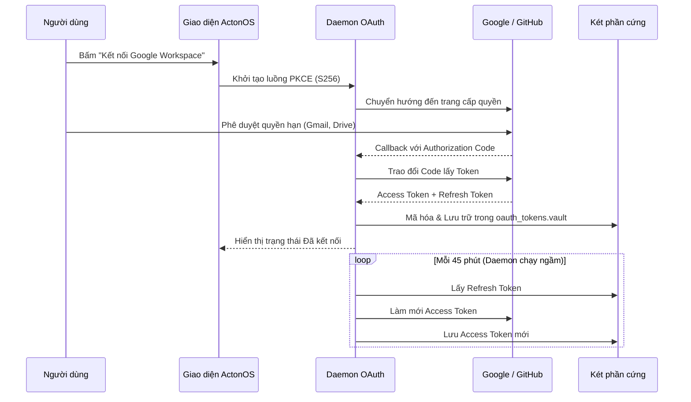

# Kết nối Dịch vụ SaaS & OAuth 2.1

Phân hệ **Kết nối (Connectors)** cho phép các Agent trong ActonOS truy cập các dịch vụ đám mây một cách an toàn qua chuẩn **OAuth 2.1 PKCE (S256)** mà không cần lưu trữ mật khẩu văn bản thô.

---

## 1. Các Dịch vụ Hỗ trợ Kết nối 1-Click

| Dịch vụ | Khả năng của Agent | Quyền yêu cầu (Scopes) |
|:---|:---|:---|
| **Google Workspace** | Đọc/gửi Gmail, tạo lịch hẹn Google Calendar, đọc/ghi tệp Google Drive | `gmail.readonly`, `gmail.send`, `drive.file`, `calendar.events` |
| **GitHub** | Tìm kiếm code, tạo issue, tạo pull request, duyệt commit | `repo`, `read:user`, `workflow` |
| **Notion** | Truy vấn cơ sở dữ liệu Notion, tạo trang mới, cập nhật bảng tác vụ | `read_content`, `update_content` |
| **Slack** | Đọc lịch sử kênh, đăng tin nhắn báo cáo, gửi tệp | `channels:history`, `chat:write` |

---

## 2. Tự động Làm mới Token Chạy ngầm

ActonOS có daemon chạy ngầm định kỳ kiểm tra hạn sử dụng của token:
- Tự động làm mới Access Token trước khi hết hạn.
- Nếu token bị hủy quyền từ phía nhà cung cấp, hệ thống sẽ phát cảnh báo yêu cầu kết nối lại trên Bảng thông báo.
