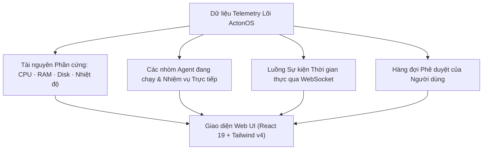

# Bảng điều khiển & Giám sát Hệ thống

**Bảng điều khiển ActonOS (Dashboard)** đóng vai trò là trung tâm kiểm soát chính để theo dõi hoạt động của các nhóm tác nhân AI, tài nguyên máy chủ, hàng đợi phê duyệt và các tiến trình tự động chạy ngầm.

---

## 1. Thanh Telemetry Giám sát Tài nguyên

Thanh trạng thái phía trên cập nhật liên tục mỗi 2 giây:
- **Đồng hồ CPU**: Tải xử lý của bộ vi xử lý theo thời gian thực.
- **Dung lượng RAM**: Bộ nhớ đang dùng so với tổng dung lượng (ví dụ `1.8 GB / 16 GB`).
- **Dung lượng Ổ cứng**: Dung lượng đã dùng trên phân vùng `/data`.
- **Huy hiệu Chế độ HAL**: Hiển thị chế độ chạy `Bare-metal (bwrap)` hoặc `Docker Container`.
- **Nhiệt độ Chip (Bare-metal)**: Đọc cảm biến nhiệt độ phần cứng qua Linux D-Bus.

---

## 2. Danh sách Agent Đang Hoạt động

Hiển thị toàn bộ các agent đang có trong hệ thống:
- **Trạng thái Agent**:
  - 🟢 `Rảnh rỗi (Idle)` - Sẵn sàng nhận lệnh hoặc chờ chu kỳ đánh thức.
  - 🟡 `Đang gọi Công cụ (Executing Tool)` - Đang chạy script, duyệt web hoặc truy vấn dữ liệu.
  - 🟣 `Đang Ủy quyền (Delegated)` - Đang phân công công việc cho nhóm agent con.
  - 🔴 `Chờ Phê duyệt (Approval Required)` - Đang tạm dừng chờ con người xác nhận hành động.
- **Thao tác Nhanh**: Bấm vào thẻ Agent để bắt đầu Chat ngay hoặc mở cấu hình trong **Agent Studio**.

---

## 3. Bảng Lệnh Toàn cục (`Ctrl + K`)

Bấm tổ hợp phím **`Ctrl + K`** (hoặc `Cmd + K` trên macOS) ở bất kỳ đâu trong ActonOS:
- **Điều hướng nhanh**: Chuyển ngay đến các trang Chat, Nhiệm vụ, Kênh chat, Cài đặt, Terminal.
- **Tìm kiếm Agent & Tệp**: Gõ tên Agent để trò chuyện hoặc tìm tệp trong Workspace.
- **Thao tác khẩn cấp**: Tạo bản sao lưu nhanh hoặc khóa màn hình phiên làm việc.

---

## 4. Hộp Thông báo Phê duyệt Hành động

Khi một Agent tự trị thực hiện thao tác nhạy cảm (như ghi đè file hệ thống, chạy lệnh shell, hoặc gửi email hàng loạt), thanh cảnh báo màu hổ phách sẽ xuất hiện:
- **Xem trước Hành động**: Tên công cụ, đường dẫn tệp và tham số dữ liệu.
- **Phê duyệt / Từ chối**: Bấm **Phê duyệt** (có thể kèm lý do) để tiếp tục chạy từ đúng điểm dừng, hoặc **Từ chối** để hủy bỏ an toàn.
