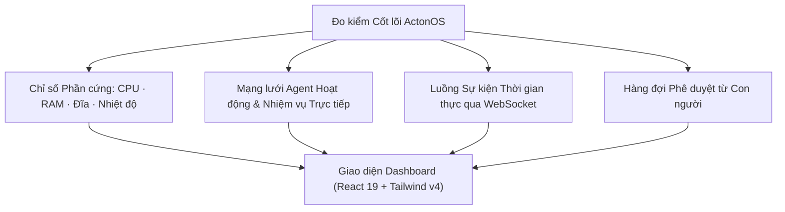

# Bảng điều khiển & Quan sát Hệ thống

**Bảng điều khiển ActonOS (Dashboard)** đóng vai trò là buồng lái trung tâm để theo dõi hoạt động của các Agent, thông số đo kiểm hệ thống, mức tiêu thụ tài nguyên và các quy trình tự động ngầm theo thời gian thực.

---

## 1. Thanh Đo kiểm Hệ thống (Top Telemetry Bar)

Thanh tiêu đề phía trên cung cấp nhịp đập liên tục của máy chủ vật lý hoặc container:

- **Đồng hồ Đo Tải CPU**: Mức tải đa nhân theo thời gian thực, cập nhật mỗi 2 giây qua ảnh chụp WebSocket snapshot.
- **Phân bổ Bộ nhớ RAM**: Dung lượng RAM đang sử dụng so với tổng dung lượng vật lý (ví dụ: `1.8 GB / 16 GB`).
- **Lưu trữ Ổ đĩa**: Dung lượng đã dùng và còn trống trên phân vùng `/data`.
- **Huy hiệu Chế độ HAL**: Hiển thị hệ thống đang chạy ở chế độ `Bare-metal (bwrap)` hay `Docker Container`.
- **Nhiệt độ Chip (Bare-metal)**: Đọc trực tiếp cảm biến nhiệt từ giao diện D-Bus của bo mạch chủ.

---

## 2. Tổng quan Danh sách Agent Đang Hoạt động

Các thẻ trung tâm hiển thị toàn bộ Agent đã được đăng ký:
- **Ảnh đại diện & Tên Agent**: Nhận diện nhanh chóng.
- **Chỉ báo Trạng thái**:
  - 🟢 `Idle` - Agent đang chờ lệnh hoặc chờ đến chu kỳ kiểm tra.
  - 🟡 `Executing Tool` - Agent đang gọi công cụ MCP, WASM, hoặc Native.
  - 🟣 `Delegated` - Agent đang điều phối các tác vụ con trong mạng lưới swarm.
  - 🔴 `Approval Required` - Agent tạm dừng để chờ con người phê duyệt.
- **Thao tác Nhanh**: Bấm vào bất kỳ thẻ Agent nào để mở cửa sổ Chat trực tiếp hoặc mở cấu hình trong **Agent Studio**.

---

## 3. Bảng Lệnh Toàn cục (Global Command Palette `Ctrl + K`)

Nhấn **`Ctrl + K`** (hoặc **`Cmd + K`** trên macOS) tại bất kỳ đâu trong ActonOS để mở thanh tìm kiếm thông minh:

- **Điều hướng Nhanh**: Di chuyển tức thì đến các trang (`Chat`, `Missions`, `Plugins`, `Skills`, `Settings`, `Terminal`).
- **Tìm kiếm Agent Trực tiếp**: Nhập tên Agent để bắt đầu trò chuyện ngay.
- **Định vị Tệp**: Tìm và mở tệp trong Workspace mà không cần duyệt cây thư mục.
- **Hành động Nhanh**: Kích hoạt **Sao lưu Hệ thống**, phát nhịp **Heartbeat Pulse**, hoặc **Khóa Phiên làm việc**.

---

## 4. Thanh Thông báo Yêu cầu Phê duyệt

Khi một Agent tự trị cố gắng thực hiện hành vi đột biến rủi ro cao (như sửa đổi tệp hệ thống, chạy lệnh shell chưa biết, hoặc phát email hàng loạt), một dải thông báo màu hổ phách sẽ xuất hiện trên Dashboard:

- **Xem trước Hành động**: Hiển thị tên công cụ, đường dẫn đích và tham số truyền vào.
- **Phê duyệt / Từ chối**: Bấm **Approve** (kèm lý do kiểm toán) để tiếp tục thực thi, hoặc **Reject** để hủy bỏ hành động an toàn.
