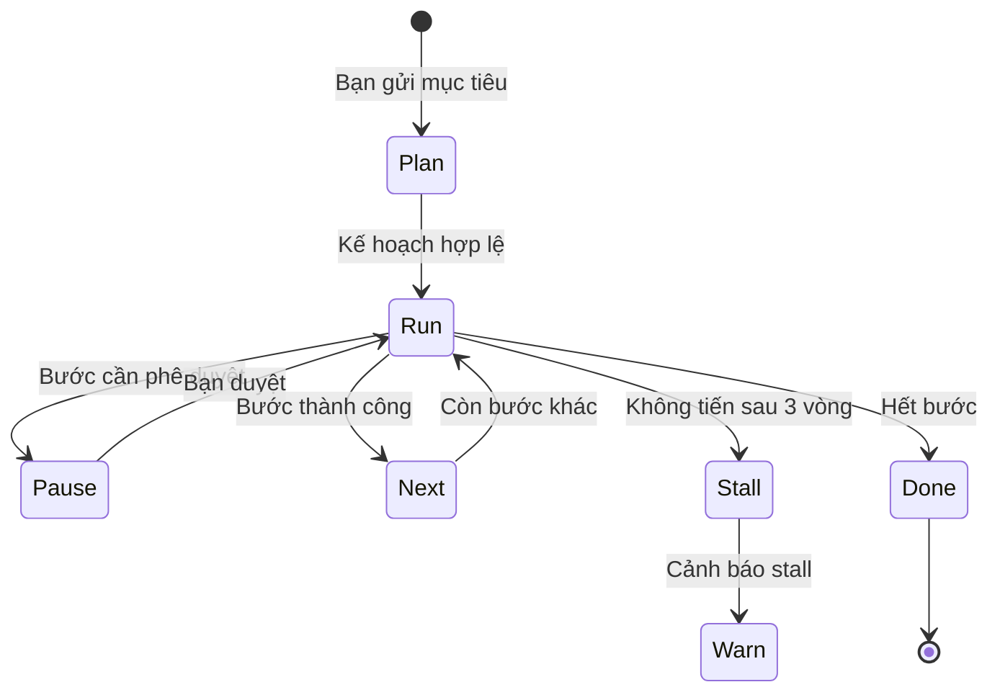

# Nhiệm vụ

**Nhiệm vụ** là việc dài: có mục tiêu viết ra, kế hoạch các bước, và checkpoint. Dùng khi một tin chat không đủ — ví dụ “kiểm tra dự án này, ghi `security_audit.md`, rồi mở issue GitHub.”

---

## Khởi chạy nhiệm vụ

1. Mở **Missions** trên thanh bên.
2. Bấm **+ Launch Mission**.
3. Điền:
   - **Mục tiêu** — kết quả bạn muốn, kể cả tên tệp.
   - **Agent** — người điều phối (ví dụ `Security Engineer`).
   - **Ưu tiên** — Low, Standard, High hoặc Critical.
   - **Thông báo** — kênh chat tùy chọn khi xong.
4. Bắt đầu.

ActonOS tách mục tiêu thành đồ thị bước: bước độc lập chạy song song; bước phụ thuộc thì chờ. Giao diện hiện Pending, Running, Completed, Blocked hoặc Failed.

---

## Nếu máy khởi động lại

Mỗi bước xong đều được lưu. Sau mất điện hoặc restart container, nhiệm vụ chạy tiếp từ checkpoint, không làm lại từ đầu.

Nếu công cụ cần duyệt, nhiệm vụ đóng băng (tin nhắn, bộ đếm, hành động đang chờ). Duyệt từ [Dashboard](dashboard) hoặc [Thông báo](notifications) thì đúng bước đó chạy tiếp.

---

## Cảnh báo stall

Nếu agent lặp cùng tiến độ hoặc cùng công cụ **ba vòng** mà kế hoạch không tiến, ActonOS cảnh báo stall.

Bạn có thể:

- Gửi tin điều hướng trong Chat.
- Tạm dừng nhiệm vụ.
- Sửa công cụ hoặc mục tiêu rồi chạy tiếp.

---

## Trang liên quan

- [Agent Studio](agent-studio) — chọn agent điều phối và công cụ.
- [Dashboard](dashboard) — duyệt bước đang dừng.
- [Vận hành trực tiếp](operations) — xem nhật ký khi chạy.
