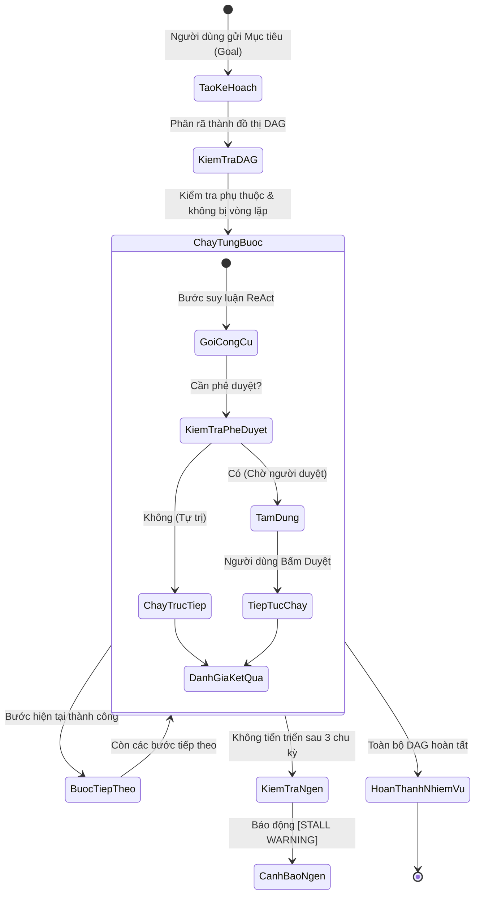

# Nhiệm vụ Tự trị & Đồ thị DAG

Động cơ **Nhiệm vụ (Missions)** cho phép các Agent trong ActonOS tự động thực hiện các mục tiêu phức tạp, nhiều giai đoạn trong thời gian dài mà vẫn đảm bảo tính toàn vẹn trạng thái và sự kiểm soát của con người.

---

## 1. Khởi tạo Mục tiêu Nhiệm vụ

1. Bấm vào mục **Nhiệm vụ (Missions)** trên thanh điều hướng.
2. Bấm nút **+ Khởi chạy Nhiệm vụ**.
3. Nhập thông tin nhiệm vụ:
   - **Chỉ thị Mục tiêu**: Mô tả mục tiêu cấp cao (ví dụ: `Quét mã nguồn trong workspace tìm lỗ hổng bảo mật, lưu báo cáo thành security_audit.md, và mở một Issue trên GitHub tóm tắt kết quả`).
   - **Agent Phụ trách**: Chọn Agent điều phối chính (ví dụ: `Kỹ sư Bảo mật`).
   - **Mức độ Ưu tiên**: `Thấp`, `Tiêu chuẩn`, `Cao` hoặc `Khẩn cấp`.
   - **Kênh Thông báo**: Tùy chọn gửi tin nhắn báo cáo về Telegram hoặc Discord khi xong.

---

## 2. Thực thi Đồ thị Phụ thuộc DAG

Khi bắt đầu, bộ lập kế hoạch `Planner` phân rã mục tiêu thành đồ thị không chu trình (DAG):
- **Kiểm tra Tính hợp lệ**: Loại bỏ các bước lặp vô nghĩa và các phụ thuộc vòng tròn.
- **Thực thi Song song & Tuần tự**: Các bước độc lập chạy đồng thời; các bước phụ thuộc sẽ chờ dữ liệu đầu ra từ bước trước.

---

## 3. Lưu Điểm Kiểm tra (Checkpointing) & Khôi phục

Mọi trạng thái chuyển giao được lưu vào cơ sở dữ liệu `agent_runs.checkpoint_json`:
- **Chống Mất Dữ liệu**: Nếu mất điện hoặc máy chủ khởi động lại, ActonOS tự động chạy tiếp từ điểm dừng gần nhất mà không thực hiện lại các thao tác đã hoàn thành.
- **Tạm dừng Chờ Duyệt**: Khi cần phê duyệt, trạng thái được đóng băng an toàn. Khi được phê duyệt, Agent sẽ tiếp tục chạy từ đúng điểm này.

---

## 4. Tự động Phát hiện Nghẽn (Stall Detection)

- Nếu Agent bị lặp lại cùng một tiến độ (`[PROGRESS: X%]`) hoặc gọi lặp lại một công cụ thất bại 3 chu kỳ liên tiếp, hệ thống sẽ phát cảnh báo **`[STALL WARNING]`**.
- Cảnh báo xuất hiện trên màn hình điều hành để người quản trị kịp thời can thiệp hoặc điều chỉnh câu lệnh.
