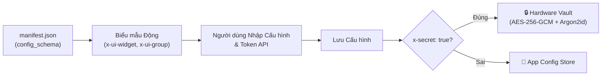

# Plugins & Tiện ích Mở rộng WASM

ActonOS tích hợp **Hệ thống Plugin WebAssembly (WASM)** thống nhất chạy trên môi trường **Wazero JIT runtime** thuần Go 100%. Thông qua trang quản trị **Plugins** (`/plugins`), người vận hành có thể khám phá, cài đặt, cấu hình và giám sát các tiện ích mở rộng cách ly (sandboxed) nhằm bổ sung **Công cụ Agent (Tools)**, **Kênh giao tiếp (Channels)**, và **Kết nối SaaS (Connectors)** mà không cần khởi động lại hệ điều hành.

---

## 1. Các Năng lực Khả dụng của Plugin

Mỗi gói plugin có thể định nghĩa một hoặc nhiều khả năng vận hành:

| Khả năng | Mục đích | Cầu nối Thực thi trên Host | Ví dụ Tích hợp |
|:---|:---|:---|:---|
| 🔧 **Tool** | Cung cấp các công cụ hàm định kiểu cho ReAct Agent Swarm. | `WasmToolBridge` $\rightarrow$ `ToolRegistry` | API thời tiết, Web Scraper, truy vấn SQL, định dạng mã nguồn |
| 💬 **Channel** | Kết nối giao thức chat bên ngoài với cơ chế đa tài khoản và định tuyến tin nhắn. | `WasmChannelBridge` $\rightarrow$ `ChannelManager` | Telegram Bot, Discord Bot, Slack App, WhatsApp, Zalo |
| 🔗 **Connector** | Kết nối nền tảng SaaS, quản lý OAuth 2.1 và tự động chuyển action thành Tool. | `WasmConnectorBridge` $\rightarrow$ `ToolRegistry` | GitHub, Notion, Linear, Google Workspace |

---

## 2. Cài đặt Plugin

ActonOS hỗ trợ hai định dạng phân phối plugin:
- **`.actonpkg`**: Định dạng gói chuẩn chứa `manifest.json`, tệp nhị phân `plugin.wasm`, biểu tượng và schema.
- **`.wasm`**: Tệp nhị phân WebAssembly biên dịch trực tiếp cho mục tiêu WASI (`wasip1`).

### Các bước cài đặt:
1. Mở menu **Extensions** → chọn **Plugins** trên thanh điều hướng.
2. Bấm nút màu vàng **+ Upload Plugin** ở góc phải phía trên.
3. Kéo và thả tệp `.actonpkg` hoặc `.wasm` vào khung tải lên (hoặc bấm để chọn tệp).
4. Xem lại bản tóm tắt quyền hạn yêu cầu của plugin:
   - **Tên miền ra ngoài (Outbound Domains)**: Danh sách whitelist các domain plugin được phép gửi HTTP request (`permissions.net_outbound`).
   - **Khóa bí mật Vault (Vault Secrets)**: Các khóa bí mật plugin được phép đọc (`permissions.secrets`).
   - **Lưu trữ Cục bộ (Persistent Storage)**: Quyền ghi vào phân vùng SQLite key-value cách ly.
5. Bấm **Install & Activate**. Hệ thống sẽ lập tức khởi tạo sandbox trong Wazero.

:::tip Hot-Reload Tức thì
ActonOS nạp và khởi chạy instance WebAssembly ngay lập tức. Không cần khởi động lại daemon hay gây gián đoạn dịch vụ.
:::

---

## 3. Cấu hình Động & Bảo mật Hardware Vault

Khi plugin khai báo `config_schema` trong `manifest.json`, ActonOS tự động sinh biểu mẫu cấu hình tương tác:

### Điểm nổi bật trên Giao diện:
- **Nhóm Gập/Mở (`x-ui-group`)**: Các trường được gom nhóm mạch lạc (ví dụ: *Cài đặt Chung*, *Tài khoản Bot*).
- **Mã hóa Khóa Bí mật (`x-secret: true`)**: Các giá trị nhạy cảm (như Bot token Discord, API key) được lưu trữ trực tiếp vào **Hardware Vault** (`vault.db`). Plugin chỉ nhận token giải mã tạm thời trong bộ nhớ sandbox.
- **Thêm Nhiều Tài khoản Bot**: Với các kênh chat, bạn có thể thêm nhiều tài khoản bot khác nhau, cấu hình token riêng và chỉ định Agent đích cho từng bot.

---

## 4. Nhật ký Thực thi Sandbox Thời gian thực (Logs)

Mỗi plugin WASM đang chạy đều có thể xuất log có cấu trúc thông qua lệnh gọi hệ thống `acton_sys: log`.

### Cách xem Nhật ký:
1. Trong danh sách **Plugins**, tìm thẻ của plugin bạn muốn kiểm tra.
2. Bấm nút **View Logs** (hoặc bấm vào thẻ và chuyển sang tab **Logs**).
3. Màn hình console trực tiếp sẽ hiển thị:
   - **Thời gian & Cấp độ**: `[INFO]`, `[WARN]`, `[DEBUG]`, `[ERROR]`.
   - **Bộ nhớ Tuyến tính**: Theo dõi trực tiếp dung lượng RAM heap được cấp phát trong WebAssembly.
   - **Lượt gọi Mạng HTTP**: Kiểm toán chi tiết các yêu cầu mạng gửi ra ngoài.

---

## 5. Quản lý Vòng đời: Bật, Tắt & Gỡ cài đặt

- **Nút Bật / Tắt (Enable / Disable)**: Tạm dừng vòng lặp sự kiện và hủy đăng ký công cụ của plugin mà không làm mất cấu hình đã lưu hay khóa bí mật trong Vault. Bật lại để kích hoạt tức thì.
- **Cập nhật Cấu hình Nóng (Hot Updates)**: Việc chỉnh sửa tham số trong modal cấu hình sẽ báo hiệu sandbox Wazero làm mới ngữ cảnh ngay lập tức mà không ảnh hưởng các agent khác.
- **Gỡ cài đặt Sạch sẽ (Clean Uninstall)**: Bấm **Uninstall Plugin** để đóng kết nối an toàn, hủy các công cụ và kênh đã đăng ký, xóa thư mục trong `/data/plugins/{id}` và dọn dẹp phân vùng KV SQLite.
