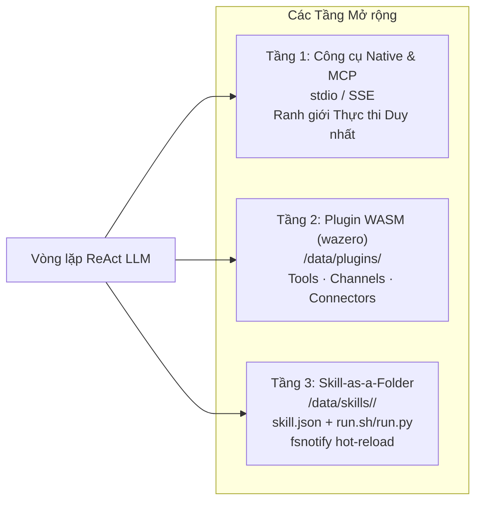

# Công cụ, MCP & Môi trường Chạy Kỹ năng

ActonOS cung cấp công cụ thực thi đa giao thức mở rộng được tổ chức thành 3 tầng mở rộng rõ rệt: **Tầng 1 (Công cụ Native & Máy chủ MCP)**, **Tầng 2 (Plugin WASM Thống nhất)**, và **Tầng 3 (Kỹ năng Thư mục Skill-as-a-Folder)**.



---

## 1. Tầng 1: Công cụ Native & Máy chủ MCP

### Công cụ Native Tích hợp Sẵn
Biên dịch trực tiếp vào tệp nhị phân tĩnh `actond` nhằm đạt tốc độ thực thi tối đa:
- `native_web_search`: Tìm kiếm thông tin web qua DuckDuckGo, Brave Search hoặc Tavily.
- `native_browser_headless`: Tự động hóa trình duyệt Chromium qua `chromedp` (trích xuất DOM, render JavaScript, chụp ảnh màn hình).
- `native_workspace_read` & `native_workspace_write`: Đọc và ghi tệp cách ly trong thư mục `/workspace`.
- `native_exec`: Thực thi lệnh shell trong môi trường Bubblewrap/Subshell jail.
- `native_sql_query`: Truy vấn cơ sở dữ liệu ứng dụng và các tệp SQLite trong workspace.

### Tích hợp Giao thức Ngữ cảnh Mô hình (MCP)
ActonOS hoạt động như một máy chủ MCP Host triển khai theo chuẩn mở của Anthropic:
- **`stdio`**: Khởi chạy tiến trình CLI cục bộ giao tiếp qua stdin/stdout JSON-RPC.
- **`http` / `sse`**: Kết nối đến máy chủ MCP từ xa qua luồng Server-Sent Events.
- Biến môi trường nhạy cảm được mã hóa an toàn trong Hardware Vault dưới khóa `mcp.env.<id>`.

---

## 2. Tầng 2: Plugin WASM Thống nhất (WASMLoader)

Các tiện ích mở rộng đa ngôn ngữ hiệu năng cao được biên dịch thành WebAssembly (`wasip1` / `wasm32-wasi`) chạy trên engine **Wazero JIT runtime** thuần Go:
- **Thực thi Cách ly (Sandbox)**: Không gian bộ nhớ tuyến tính độc lập, không thể truy cập trực tiếp file hệ thống host trừ khi qua syscall.
- **Tường lửa Egress**: Mọi truy cập HTTP ra ngoài bị giới hạn chặt chẽ theo whitelist `manifest.permissions.net_outbound`.
- **Hợp nhất Năng lực**: Gom chung **Agent Tools**, **Chat Channels**, và **SaaS Connectors** vào các gói phân phối chuẩn `.actonpkg`.

---

## 3. Tầng 3: Kiến trúc Kỹ năng Thư mục (Skill-as-a-Folder)

Người dùng và lập trình viên có thể tạo kỹ năng tùy chỉnh nhanh chóng bằng cách tạo một thư mục trong `/data/skills/`:

```
/data/skills/my_custom_skill/
├── skill.json      # Định nghĩa schema và tham số công cụ
└── run.sh          # Tệp thực thi (hoặc run.py)
```

### Hot-Reload với `fsnotify`
Bộ theo dõi kỹ năng của ActonOS tự động quét thư mục `/data/skills/`. Việc tạo mới, sửa hoặc xóa kỹ năng sẽ lập tức cập nhật danh mục công cụ mà không cần khởi động lại daemon.
